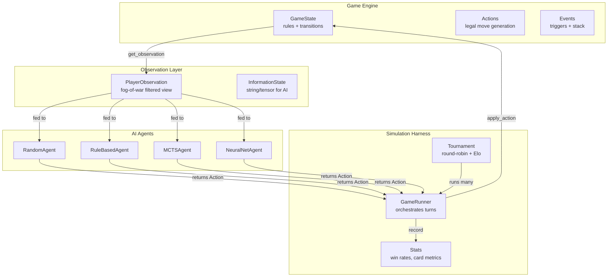
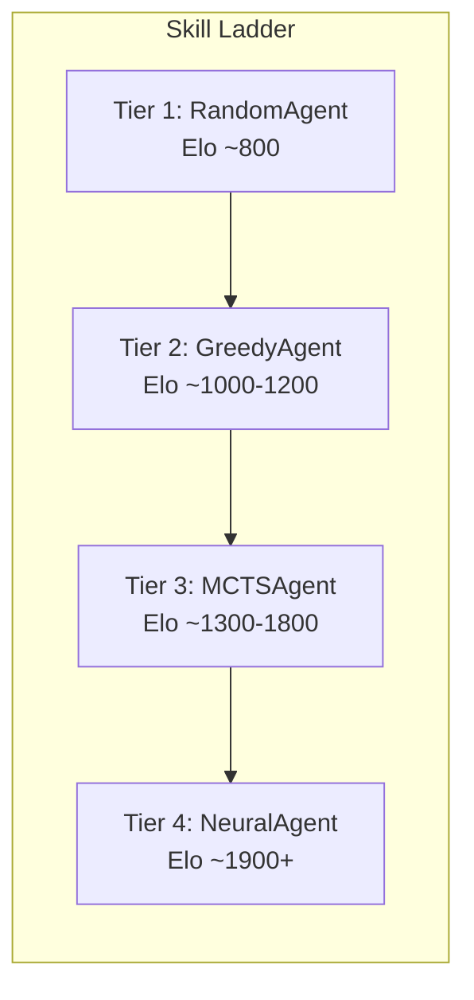
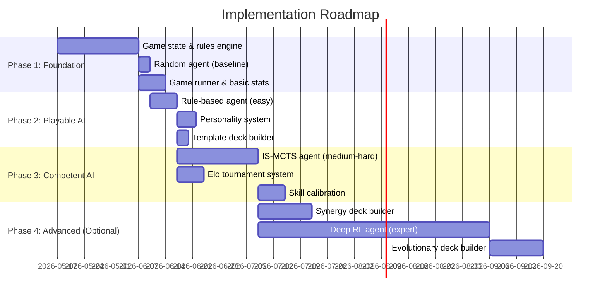

# AI Opponents for a 4-Player Trading Card Game: A Comprehensive Guide

## Executive Summary

Building computerized opponents for a complex 4-player trading card game requires solving three interconnected problems: (1) a **simulation engine** that enforces rules, manages hidden information, and supports fast state cloning; (2) **AI agents** of varied skill that decide which actions to take; and (3) a **harness** for running thousands of automated games to measure AI quality and balance cards. This report synthesizes findings from 25+ open-source projects, 20+ academic papers, and multiple LLM game-playing benchmarks to recommend a practical, incremental architecture. The recommended approach starts with rule-based heuristic agents (playable in days), layers in Information Set Monte Carlo Tree Search for mid-tier AI (weeks), and optionally adds deep reinforcement learning for expert-level play (months). General-purpose LLMs (GPT-4, Claude, etc.) can play card games zero-shot with explainable reasoning and personality control, but cost/latency constraints make them impractical for bulk simulation — they're best suited as personality-rich opponents for human-facing play or for bootstrapping heuristic weights. For the 4-player setting specifically, **max^n MCTS with PIMC determinization** is the most practical search strategy, supplemented by threat-scoring heuristics for target selection and coalition behavior.

---

## Table of Contents

1. [Architecture Overview](#1-architecture-overview)
2. [The Simulation Engine](#2-the-simulation-engine)
3. [AI Techniques — From Simple to Superhuman](#3-ai-techniques)
4. [LLM-Based Game Agents](#4-llm-based-game-agents)
5. [Handling Imperfect Information](#5-handling-imperfect-information)
6. [The 4-Player Challenge](#6-the-4-player-challenge)
7. [Skill Level Variation](#7-skill-level-variation)
8. [Deck Building AI](#8-deck-building-ai)
9. [Game Simulation Harness](#9-game-simulation-harness)
10. [Go-Specific Implementation Guidance](#10-go-specific-implementation-guidance)
11. [Recommended Implementation Roadmap](#11-recommended-implementation-roadmap)
12. [Key Repositories Summary](#12-key-repositories-summary)
13. [Confidence Assessment](#13-confidence-assessment)
14. [Footnotes](#14-footnotes)

---

## 1. Architecture Overview

Every successful card game AI project converges on the same fundamental architecture: a strict separation between the **game engine** (rules), **AI agents** (decision-making), and **simulation harness** (orchestration)[^1][^2][^3].



**The critical rule**: AI agents never see `GameState` directly — they only receive `PlayerObservation`, which is filtered to show only what that player can legitimately know[^4][^5].

---

## 2. The Simulation Engine

### 2.1 The Game/State/Action Triad

OpenSpiel's `State` abstract class is the gold standard for this pattern[^6]:

```go
// Adapted to Go from OpenSpiel's C++ State interface
type GameState interface {
    CurrentPlayer() int
    LegalActions() []Action
    ApplyAction(action Action)
    IsTerminal() bool
    FinalScores() []float64         // one per player
    Clone() GameState               // MUST be cheap — used in every MCTS node
    GetObservation(playerID int) PlayerObservation
    InformationStateString(playerID int) string
    // For IS-MCTS determinization:
    ResampleFromInfostate(playerID int, rng *rand.Rand) GameState
}
```

The `Clone()` method is the single most important method — it enables all lookahead search by letting AI simulate "what if" without corrupting the real game[^7][^8].

### 2.2 Event System and Turn Structure

Complex card games need an event/trigger system for abilities that fire in response to game actions. Fireplace (Hearthstone simulator) demonstrates the canonical approach[^9]:

- **Action Stack**: Actions push onto a stack; triggered abilities can trigger other abilities. Deaths are only processed once the stack is empty[^10].
- **Event Broadcasting**: Every action broadcasts to all entities. Cards with matching triggers respond[^11].
- **Phase State Machine**: Turn phases (Untap → Draw → Main → Combat → End) drive which actions are legal[^12].

```go
// Phases control what actions are legal at any point
type Phase int
const (
    PhaseUpkeep Phase = iota
    PhaseDraw
    PhaseMain
    PhaseCombat
    PhaseEnd
)

func (g *GameState) LegalActions() []Action {
    switch g.Phase {
    case PhaseMain:
        return g.mainPhaseActions()
    case PhaseCombat:
        return g.combatActions()
    // ...
    }
}
```

### 2.3 Design Patterns

| Pattern | Purpose | Example |
|---------|---------|---------|
| **Strategy** | Swappable AI implementations | OpenSpiel's `Bot` interface[^13] |
| **Observer** | Logging, stats, replay without coupling | Fireplace's `GameManager`/`BaseObserver`[^14] |
| **Command** | Actions as first-class objects (undo/redo, replay) | Fireplace's `Action` base class[^15] |
| **State** | Phase-driven legal action generation | OpenSpiel Hearts' `Phase` enum[^16] |

---

## 3. AI Techniques

### 3.1 Rule-Based / Heuristic Agents

The simplest and most immediately useful approach. A rule-based agent follows priority-ordered heuristics and scores actions with a weighted evaluation function[^17].

**How it works**: Enumerate legal actions, score each based on heuristic weights (board presence, card advantage, life differential, tempo), pick the highest-scoring action.

**Real-world example** — SabberStone's pluggable `IScore` interface enables archetype-specific scoring (Aggro vs Control vs Midrange)[^18]:

```go
type Scorer interface {
    Score(obs PlayerObservation) float64
}

type AggroScorer struct{}
func (s AggroScorer) Score(obs PlayerObservation) float64 {
    score := 0.0
    if obs.OpponentLife < 1 { return math.MaxFloat64 }
    if obs.MyLife < 1 { return -math.MaxFloat64 }
    score += float64(obs.MyBoardAttack) * 10
    score += float64(obs.MyLife - obs.OpponentLife) * 5
    score -= float64(obs.OpponentTauntHealth) * 1000
    return score
}
```

| Pros | Cons |
|------|------|
| Zero training required — works immediately | Misses complex multi-turn lines |
| Perfectly tunable via weight adjustment | Brittle to new card mechanics |
| Deterministic and debuggable | Easily exploited by search-based AI |
| Fast — milliseconds per decision | Quality ceiling limited by designer knowledge |

### 3.2 Monte Carlo Tree Search (MCTS)

MCTS builds a search tree by repeatedly selecting, expanding, simulating (random playout), and backpropagating results. It requires no domain knowledge and naturally handles large action spaces[^19].

**For card games with hidden information**, standard MCTS doesn't work because you can't build an accurate tree when you don't know opponents' cards. Two adaptations exist:

**Determinization / PIMC (Perfect Information Monte Carlo)**: Sample a possible world consistent with your observations (randomly assign unknown cards to opponents), run MCTS on that complete state, repeat with multiple samples and aggregate[^20][^21].

**Information Set MCTS (IS-MCTS)**: Build the tree over *information sets* (what the player can observe) rather than exact game states. Multiple possible worlds share tree nodes. This avoids "strategy fusion" artifacts from naive determinization[^22].

The most directly relevant implementation is the French Tarot IS-MCTS (4-5 player card game with hidden information)[^23]:

```python
# Conceptual IS-MCTS loop (from seduq/tarot)
for i in range(iterations):
    determinized_game = determinize(game)  # sample hidden info
    simulate(determinized_game)            # MCTS on complete state
# Pick action with most visits across all determinizations
```

**For 4 players**, MCTS uses **max^n**: each player maximizes their own return, ignoring others' rewards[^24]. This is backed by published research on multi-player UCT[^25].

| Pros | Cons |
|------|------|
| No training required — anytime algorithm | Determinization can be biased (strategy fusion) |
| Handles huge action spaces via progressive widening | Slow per-move (100-1000+ simulations) |
| Configurable strength via `max_simulations` | Random rollouts are noisy in complex TCGs |
| Tree is inspectable for debugging | 4-player alliances not modeled by max^n |

### 3.3 Counterfactual Regret Minimization (CFR)

CFR is an iterative self-play algorithm that converges to a Nash equilibrium by minimizing "regret" — how much worse the current strategy is compared to the best fixed alternative[^26]. OpenSpiel provides implementations of vanilla CFR, CFR+, and Monte Carlo CFR variants[^27].

**Critical limitation for 4-player TCGs**: CFR's Nash equilibrium guarantees only hold for 2-player zero-sum games. For 4-player general-sum games, the theoretical guarantees weaken significantly and state space explosion makes tabular CFR intractable[^28]. **Deep CFR** (neural network approximation) is viable but mostly validated on 2-player poker[^29].

**Recommendation**: CFR is a research avenue, not a production solution for a 4-player TCG. Use MCTS or Deep RL instead.

### 3.4 Deep Reinforcement Learning

The strongest approaches combine neural networks with self-play training:

**Deep Monte Carlo (DouZero)** — ICML 2021[^30]: Plays complete game episodes, then updates a neural Q-value network toward observed Monte Carlo returns. Uses LSTM + dense layers to handle variable-size action spaces. Achieved state-of-the-art in 3-player DouDizhu with just 4 GPUs over several days of training.

**Perfect Information Distillation (PerfectDou)** — NeurIPS 2022[^31]: Trains with access to all hidden information (perfect info critic), but the learned policy only sees partial information at execution time. The network learns patterns from seeing all cards, then generalizes to imperfect-information play.

**Neural Fictitious Self-Play (NFSP)**[^32]: Combines a DQN best-response agent with a supervised average-policy network. The agent alternates between greedy exploitation and average-policy play, converging toward Nash equilibrium. RLCard provides a clean PyTorch implementation[^33].

**Mortal** — 4-player Japanese Mahjong[^34]: Probably the closest open-source analog to a 4-player TCG. 4 players, imperfect information, complex action spaces. Built in Rust + PyTorch.

| Pros | Cons |
|------|------|
| Best absolute performance achievable | Requires GPU-days of training |
| Fast at inference (single forward pass) | Requires a working game simulator first |
| Handles huge action spaces (LSTM encoding) | Black box — hard to debug decisions |
| Varied skill via checkpoint selection | 4-player self-play can cycle |

### 3.5 Technique Comparison Matrix

| Challenge | MCTS/IS-MCTS | CFR | Deep RL | Rule-Based |
|-----------|-------------|-----|---------|-----------|
| Hidden cards | ✅ Determinization | ✅ Info sets | ✅ Learned implicitly | ⚠️ Heuristic |
| 4-player dynamics | ✅ max^n | ❌ Nash breaks | ✅ Self-play | ⚠️ Local only |
| Large action spaces | ✅ Progressive widening | ❌ Exponential | ✅ LSTM encoding | ✅ Rank options |
| Runtime speed | ⚠️ 100-1000 sims | ❌ Offline only | ✅ Single pass | ✅ Milliseconds |
| Varied skill | ✅ sim count | ❌ Single equilibrium | ✅ Checkpoints | ✅ Weight tuning |
| Training cost | ✅ None | ⚠️ Moderate | ❌ High | ✅ None |

---

## 4. LLM-Based Game Agents

There is **substantial and growing research (2023–2025)** on using general-purpose LLMs (GPT-4, Claude, Llama, etc.) as game-playing decision agents. Card games — including poker, Hearthstone, Magic: The Gathering, and Slay the Spire — are specifically studied.

### 4.1 Key Research Results

**Suspicion-Agent** (COLM 2024)[^78] — GPT-4 plays imperfect-information poker variants using Theory of Mind, **outperforming NFSP and DQN baselines without any training**. GPT-4 demonstrates high-order Theory of Mind (modeling opponents' beliefs about its own strategy). However, it cannot beat CFR+ (Nash equilibrium solver), establishing a clear ceiling.

**PokerBench** (AAAI 2025)[^79] — GPT-4 achieves 53.55% accuracy on game-theory-optimal poker decisions. All state-of-the-art LLMs "significantly lack in their ability to play game theory optimal poker." However, a **fine-tuned Llama-3-8B outperforms GPT-4** after training on 560k examples — domain-specific fine-tuning dramatically outperforms scale.

**PokéLLMon** (TOIT 2025)[^80] — GPT-4 plays competitive Pokémon battles at **49-56% win rate vs humans** (near human parity) using chain-of-thought prompting, knowledge retrieval, and in-context reinforcement learning. The most detailed open-source prompt engineering reference.

**UrzaGPT** (2025)[^81] — LoRA-tuned Llama-3-8B achieves 66% accuracy on MTG draft card selection. Zero-shot GPT-4o: 43%. Zero-shot Llama-3-8B: 0% (completely unable). Demonstrates that small LLMs fail entirely on zero-shot card game tasks while GPT-4 has significant capability from training corpus knowledge.

**Slay the Spire** (FDG 2024)[^82] — LLMs demonstrate general game-playing capability as zero-shot agents in a deck-building card game, choosing which cards to play each turn based on text descriptions of battle state.

**GameBench** (2024)[^83] — Across 9 strategy games, GPT-4 **without scaffolding scores worse than random**. Chain-of-Thought improves it to above random but still below human level. No LLM matches human performance on any game. On the card trading game "Pit," all LLMs including GPT-4-CoT score identically to random.

**GAMA-Bench** (ICLR 2025)[^84] — Benchmarked 13 LLMs across 8 game-theory scenarios. Gemini-1.5-Pro tops at 69.8/100, GPT-4o at 66.7, LLaMA-3.1-70B at 65.9, GPT-3.5 variants in 42-45 range.

**Hearthstone LLM+RL** (AAMAS 2025)[^85] — Fine-tuned LLM combined with RL achieves better generalization than either alone for card game play, suggesting the most promising long-term approach.

**LLM-MTG-DDA** (Entertainment Computing, 2025)[^86] — LLM acts as an MTG player to dynamically adjust difficulty, successfully modeling specific skill levels. Directly relevant to the varied-skill-level requirement.

### 4.2 Prompt Engineering for Game Decisions

The most detailed prompt pattern comes from PokéLLMon[^80]:

```
System: You are playing [game name]. Rules: [brief rules summary]

Historical turns:
Turn 4: Player 2 played Fire Dragon (ATK:5, HP:3) targeting your Shield Bearer.
        Shield Bearer destroyed. You drew 1 card.

Turn 5 (Current):
Your hand: [card name, type, cost, ATK, HP, effect — for each card]
Your field: [active cards with current stats]
Opponent fields: [visible cards per opponent with stats]
Life totals: You: 18, P2: 12, P3: 20, P4: 15

Legal actions:
1. Play "Flame Bolt" targeting P2's Fire Dragon (cost: 2 mana)
2. Play "Healing Wave" on self (cost: 3 mana)
3. Attack with "Iron Golem" → P3's "Forest Sprite"
4. End turn

Output your decision as JSON:
{"reasoning": "P2 is closest to winning with 2 creatures on board...",
 "action": 1}
```

**Key patterns that work:**
- Enumerate **only legal actions** (prevents hallucinated illegal moves)[^87]
- Use **chain-of-thought** ("think step by step") — consistently improves performance[^83][^84]
- Include **recent turn history** as text log for context
- Request **structured JSON output** with reasoning + action index
- **Self-consistency** (3 independent completions, majority vote) improves important decisions[^80]

### 4.3 Strengths and Weaknesses

| Strength | Detail |
|----------|--------|
| **Zero-shot play** | Describe rules in prompt — no training needed for new games[^78] |
| **Explainable decisions** | CoT produces human-readable strategy reasoning[^80] |
| **Theory of Mind** | GPT-4 models opponent intentions/beliefs in imperfect-info games[^78] |
| **Personality via prompting** | "Play aggressively" vs "play conservatively" creates varied opponents trivially[^79] |
| **Card text understanding** | GPT-4 grasps complex TCG mechanics from training data[^81] |
| **Skill level via prompt** | Instruct the LLM to play as a beginner/expert; adjust temperature[^86] |

| Weakness | Detail |
|----------|--------|
| **Cost** | ~$0.10-0.40/game (Haiku/GPT-4o-mini); ~$3-5/game (GPT-4)[^88] |
| **Latency** | 0.3-5s per decision; a 50-decision game takes 1-4 min vs <1s for MCTS[^88] |
| **Not optimal** | 53% accuracy on GTO poker; worse-than-random on some novel games[^79][^83] |
| **Illegal moves** | LLMs hallucinate invalid actions without legal-move filtering[^87] |
| **Long-horizon planning** | Weak at multi-turn planning; better at single-turn tactics[^83] |
| **No persistent state** | Treats each prompt in isolation; can't build world models across turns[^89] |

### 4.4 Cost and Latency for Simulation

| Model | Cost per game (~50 decisions) | Latency per decision | 1,000 games cost |
|-------|------------------------------|---------------------|-----------------|
| GPT-4 | $3-5 | 1-5s | $3,000-5,000 |
| GPT-4o | $0.25-0.40 | 0.5-2s | $250-400 |
| Claude 3.5 Haiku | $0.10-0.15 | 0.3-1s | $100-150 |
| GPT-3.5-turbo | ~$0.05 | 0.3-1s | ~$50 |
| Local Llama-3-8B | ~$0 marginal | 0.1-0.3s | Hardware only |

PokerBench had to **limit GPT-4 evaluation to 1,000 hands** due to inference cost, while local fine-tuned models could run 50,000 hands for statistical significance[^79]. This is the fundamental constraint for simulation at scale.

### 4.5 Hybrid Approaches

The most promising pattern combines LLMs with traditional AI:

**LLM + MCTS (RAP framework)**[^90]: The LLM serves as both world model (predicting next state) and evaluation function. MCTS handles exploration. Llama-33B + RAP outperforms CoT on GPT-4 by 33% for plan generation.

**LLM for strategy, traditional AI for tactics**: Cicero (Meta, 2022)[^91] used RL for tactical decisions and LLM for negotiation in Diplomacy, achieving top 10% ranking against humans online.

**LLM to bootstrap heuristics**: Use an LLM to generate or tune the heuristic weights for a rule-based agent, then execute deterministically. This gives LLM-quality strategic insight at rule-based speed and cost.

**Fine-tune small models**: PokerBench shows a fine-tuned 8B model outperforming GPT-4. Train a small model on your game's decision data, then run it locally at near-zero marginal cost[^79].

### 4.6 Practical Recommendation

LLMs are **excellent for personality-rich opponents and prototyping** but **impractical as the primary AI for bulk simulation**:

- **For running thousands of automated games** → use traditional AI (rule-based + MCTS). Cost and latency make LLMs impractical at scale.
- **For interesting, diverse opponents with personality** → LLMs are unmatched. A Haiku-class model with a personality prompt creates a convincing, explainable opponent instantly with zero training.
- **Best hybrid**: Traditional AI for bulk simulation/balance testing; LLM agents as an optional tier for human-facing play or to bootstrap heuristic weights for rule-based agents.

### 4.7 Key Projects

| Project | URL | What it does |
|---------|-----|-------------|
| PokéLLMon | [git-disl/PokeLLMon](https://github.com/git-disl/PokeLLMon) | GPT-4 Pokémon battle agent with full prompt templates |
| GAMABench | [CUHK-ARISE/GAMABench](https://github.com/CUHK-ARISE/GAMABench) | 13-LLM × 8-game benchmark (ICLR 2025) |
| GameBench | [Joshuaclymer/GameBench](https://github.com/Joshuaclymer/GameBench) | 9-game strategic reasoning benchmark |
| TextArena | [TextArena/TextArena](https://github.com/TextArena/TextArena) | 100+ text game environments with TrueSkill leaderboard |
| Suspicion-Agent | [CR-Gjx/Suspicion-Agent](https://github.com/CR-Gjx/Suspicion-Agent) | GPT-4 with Theory of Mind for card games |
| AgentBench | [THUDM/AgentBench](https://github.com/THUDM/AgentBench) | 8-environment agent benchmark including a Digital Card Game |
| LLM Game Agent Survey | [git-disl/awesome-LLM-game-agent-papers](https://github.com/git-disl/awesome-LLM-game-agent-papers) | Curated paper list (ACM CSUR) |

---

## 5. Handling Imperfect Information

### 5.1 The Core Problem

In a TCG, each player knows their own hand but not opponents' hands, the deck order, or face-down cards. The AI must make decisions based on incomplete information without cheating.

### 5.2 Pattern A: Dual Observation Methods

Fireplace (Hearthstone) uses separate `dump()` and `dump_hidden()` methods — one shows full state for the engine, the other shows only what opponents can see[^35]:

```go
func (g *GameState) GetObservation(playerID int) PlayerObservation {
    obs := PlayerObservation{PlayerID: playerID}
    obs.MyHand = g.Hands[playerID]              // full info
    obs.OtherHandSizes = make([]int, g.NumPlayers)
    for i, hand := range g.Hands {
        if i != playerID {
            obs.OtherHandSizes[i] = len(hand)   // count only
        }
    }
    obs.Field = g.Field                          // public
    obs.DeckSize = len(g.Deck)                   // count only
    obs.DiscardPile = g.DiscardPile              // public
    obs.LegalActions = g.LegalActionsFor(playerID)
    return obs
}
```

### 5.3 Pattern B: Information State Strings

OpenSpiel's approach: compute a per-player string encoding of everything that player has observed. Two states with the same information state string are indistinguishable to that player — they form an "information set"[^36].

OpenSpiel's Hearts shows what a 4-player card game's information state contains[^37]:
- Cards dealt to this player (52 bools)
- Cards passed/received (52 bools each)
- Current hand (52 bools)
- Current point totals per player
- History of all visible tricks

### 5.4 Determinization for AI Search

When an AI needs to search ahead, it samples a consistent world state:

```go
func (g *GameState) ResampleFromInfostate(playerID int, rng *rand.Rand) GameState {
    clone := g.Clone()
    // Collect all cards NOT known to this player
    unknownCards := collectUnknownCards(clone, playerID)
    rng.Shuffle(len(unknownCards), func(i, j int) {
        unknownCards[i], unknownCards[j] = unknownCards[j], unknownCards[i]
    })
    // Distribute to opponents' hands (maintaining hand size counts)
    distributeToHands(clone, playerID, unknownCards)
    return clone
}
```

Hearts implements `ResampleFromInfostate()` for exactly this purpose[^38]. The IS-MCTS agent runs MCTS on multiple such samples and aggregates action scores.

---

## 6. The 4-Player Challenge

### 6.1 Multi-Player Search Algorithms

Three main approaches exist for multi-player search trees[^39][^40][^41]:

| Algorithm | How It Works | Pros | Cons |
|-----------|-------------|------|------|
| **Max^n** | Each player maximizes own score component | Realistic self-interest; no alpha-beta possible | Can cause kingmaking |
| **Paranoid** | Treat all opponents as colluding against you | Enables alpha-beta pruning; searches 2-3× deeper | Overly pessimistic |
| **Best Reply Search (BRS)** | Only the *strongest* opponent counter-move is searched | Deeper than Max^n; more accurate than Paranoid; alpha-beta works | Assumption: only one opponent is dangerous per move |

Academic research (Schadd & Winands 2011) finds **BRS consistently outperforms both Max^n and Paranoid** across tested multiplayer board games[^42]. For imperfect-information games, **MCTS with PIMC + max^n rollout policy** is preferred over minimax variants[^43].

### 6.2 Target Selection

In a 4-player game, the AI must decide whom to attack. Build a per-opponent threat vector[^44]:

```go
type OpponentThreat struct {
    LifeTotal    int
    HandSize     int
    BoardPower   float64
    TurnsToWin   float64
}

func ComputeThreatScore(threat OpponentThreat) float64 {
    score := 100.0 / math.Max(1, threat.TurnsToWin)  // urgency
    score += threat.BoardPower * 2.0                   // immediate danger
    score += float64(threat.HandSize) * 1.5            // resource threat
    score -= float64(threat.LifeTotal) * 0.5           // survival buffer
    return score
}
```

**Target priority strategies**:
- **Attack the leader** (highest threat score) — prevents kingmaking
- **Attack the weakest** (finish them off) — reduces opponent count
- **Attack who threatens YOU** — defensive play
- These can be tuned per AI personality (aggressive AIs attack weakest; defensive AIs attack leader)[^45]

### 6.3 Coalition / Kingmaking

Monitor the "leader gap" — `max_proximity - median_proximity`. When the gap exceeds a threshold (e.g., 30% of win condition), trigger coalition behavior: apply a bonus when actions specifically harm the leader[^46].

**Kingmaking mitigation** (from the boardspace.net Medina implementation)[^47]:
- Cap the coalition benefit — don't sacrifice yourself just to hurt the leader
- Add a self-preservation floor — never choose a losing move just to damage an opponent
- The modified paranoid evaluation works well for endgame (≤2 players remaining)

### 6.4 Training for 4-Player: Population-Based Self-Play

Simple self-play with 4 copies of the same agent can produce non-transitive cycles (A beats B, B beats C, C beats A). **PSRO (Policy-Space Response Oracles)** solves this by maintaining a population of policies and computing meta-strategies[^48]:

1. Maintain a population (policy library) per player seat
2. Compute a meta-strategy over the population (use **Projected Replicator Dynamics** for 4-player general-sum games)[^49]
3. Train a best response to the meta-strategy mixture
4. Add to population; repeat

For 4-player games, **JPSRO** (Joint PSRO, ICML 2021) targets Correlated Equilibrium rather than Nash, which is more tractable for n>2 players[^50].

---

## 7. Skill Level Variation

### 7.1 Tiered Architecture

The most effective approach uses fundamentally different AI types for different skill bands, creating a natural skill ladder[^51]:



| Tier | Agent Type | Skill Band | Implementation |
|------|-----------|-----------|---------------|
| 1 | Random | Baseline (~800 Elo) | Pick uniformly from legal actions |
| 2 | Rule-Based/Greedy | Easy (1000-1200) | Score each action independently, pick best |
| 3 | MCTS | Medium-Hard (1300-1800) | IS-MCTS with configurable simulation budget |
| 4 | Neural Network | Expert (1900+) | Trained via self-play (Deep MC or PPO) |

### 7.2 Fine-Grained Skill Within Tiers

**For rule-based agents**: Add noise to scores[^52]:
```go
func (a *GreedyAgent) ChooseAction(obs PlayerObservation) Action {
    bestScore := math.Inf(-1)
    var bestAction Action
    for _, action := range obs.LegalActions {
        score := a.scorer.Score(obs, action)
        score += a.rng.NormFloat64() * a.noiseLevel // ε ∈ [0.3, 1.5]
        if score > bestScore {
            bestScore = score
            bestAction = action
        }
    }
    return bestAction
}
```

**For MCTS agents**: Adjust `maxSimulations`[^53]:
- 50 simulations → beginner
- 200 simulations → intermediate
- 1000 simulations → advanced
- 5000 simulations → expert

**For neural agents**: Use different training checkpoints — early checkpoints are weaker, late checkpoints are stronger[^54].

### 7.3 Personality System

Beyond skill level, AI personality creates diverse opponents. Two proven approaches:

**Weighted evaluation** — adjust what the AI values[^55]:

```go
type AIPersonality struct {
    Aggression     float64 // 0.0=defensive, 1.0=all-out attack
    RiskTolerance  float64 // 0.0=risk-averse, 1.0=high risk
    Archetype      string  // "aggro"|"control"|"midrange"|"combo"
    
    // "Beginner mistake" flags:
    TrackCardAdvantage  bool // false = beginner ignores hand size
    TrackMultiTurnPlans bool // false = beginner plays greedily
    TrackOpponentThreats bool // false = beginner ignores board state
}
```

**Strategy archetypes** — different evaluation weight profiles per deck type[^56]:
- Aggressive: high attack weight, low defense weight, favors direct damage
- Defensive: high health weight, high board control, favors removal
- Combo: high synergy weight, favors specific card interactions

### 7.4 Elo Calibration

Use multiplayer Elo with pairwise decomposition to measure and calibrate skill[^57]:

```go
// 4-player Elo: decompose into C(4,2)=6 virtual pairwise matchups
func UpdateMultiplayerRatings(rankings []PlayerID, ratings map[PlayerID]float64) {
    nPlayers := len(rankings)
    for i := 0; i < nPlayers; i++ {
        for j := i + 1; j < nPlayers; j++ {
            winner, loser := rankings[i], rankings[j]
            expected := 1.0 / (1.0 + math.Pow(10, (ratings[loser]-ratings[winner])/400.0))
            k := 32.0 / float64(nPlayers-1) // divide K by (n-1) for stability
            ratings[winner] += k * (1.0 - expected)
            ratings[loser] += k * (0.0 - (1.0 - expected))
        }
    }
}
```

Run a round-robin tournament of all agent variants, then tune parameters until agents fall in target Elo bands[^58].

---

## 8. Deck Building AI

For a TCG simulation, AI opponents also need to construct decks. Five tiers of increasing sophistication[^59]:

### Tier 0: Random (½ day)
Randomly sample legal cards. Often produces unplayable decks, but useful as a baseline.

### Tier 1: Template (1-2 days)
Pre-defined archetype templates with target mana cost distributions[^60]:

```go
var ArchetypeTemplates = map[string]CurveDistribution{
    "aggro":    {0: 0.15, 1: 0.25, 2: 0.25, 3: 0.20, 4: 0.10, 5: 0.05},
    "midrange": {0: 0.05, 1: 0.15, 2: 0.20, 3: 0.25, 4: 0.20, 5: 0.10, 6: 0.05},
    "control":  {0: 0.05, 1: 0.10, 2: 0.15, 3: 0.15, 4: 0.20, 5: 0.15, 6: 0.10, 7: 0.10},
}
```

### Tier 2: Curve-Optimized (2-3 days)
Fill to archetype curve, sorting candidates by stat efficiency (`(attack+health)/cost`).

### Tier 3: Synergy-Aware (1-2 weeks)
Score card candidates by keyword/tag overlap with current deck. Cards sharing tribal tags, mechanic synergies, or thematic keywords score higher[^61].

### Tier 4: Evolutionary (ongoing)
Genetic algorithm using tournament win rate as fitness function. Maintain a population of decks, evolve via crossover and mutation, evaluate by running simulated games[^62]. FAB_Sim demonstrates a complete implementation with niche diversity pressure and neural net deck evaluation[^63].

### Win-Rate Feedback Loop
After simulated games, record which cards appeared in winning vs losing decks. Compute `net_score = card_win_rate - archetype_baseline_win_rate`. Use this as a card selection weight for future deck building — simple but powerful for iterative improvement[^64].

---

## 9. Game Simulation Harness

### 9.1 Game Runner

OpenSpiel's `evaluate_bots()` is the minimal, clean template[^65]:

```go
func RunGame(state GameState, agents []Agent, rng *rand.Rand) GameResult {
    for _, agent := range agents {
        agent.NewGame()
    }
    var history []ActionRecord
    
    for !state.IsTerminal() {
        player := state.CurrentPlayer()
        obs := state.GetObservation(player)
        action := agents[player].ChooseAction(obs)
        
        // Inform OTHER agents what happened (for stateful agents)
        for i, agent := range agents {
            if i != player {
                agent.ObserveAction(player, action)
            }
        }
        
        history = append(history, ActionRecord{player, action})
        state.ApplyAction(action)
    }
    
    return GameResult{
        Scores:  state.FinalScores(),
        History: history,
        Turns:   len(history),
    }
}
```

**Critical design**: `ObserveAction()` lets stateful agents (those tracking belief state about opponents) know what happened even when it's not their turn[^66].

### 9.2 Parallel Tournament

Since each game is fully self-contained (deterministic given seed + actions), games parallelize trivially[^67]:

```go
func RunTournament(nGames int, agentConfigs []AgentConfig, workers int) TournamentResult {
    results := make(chan GameResult, nGames)
    sem := make(chan struct{}, workers)
    
    for seed := 0; seed < nGames; seed++ {
        sem <- struct{}{}
        go func(s int) {
            defer func() { <-sem }()
            rng := rand.New(rand.NewPCG(uint64(s), 0))
            state := NewGameState(rng)
            agents := makeAgents(agentConfigs, rng)
            results <- RunGame(state, agents, rng)
        }(seed)
    }
    
    close(results)
    return aggregateResults(results)
}
```

### 9.3 Replay System

Store `(seed, action_history)` — since game state is deterministic given seed + actions, any game can be reconstructed for debugging[^68]:

```go
func ReplayGame(seed int, history []ActionRecord) []GameState {
    rng := rand.New(rand.NewPCG(uint64(seed), 0))
    state := NewGameState(rng)
    snapshots := []GameState{state.Clone()}
    for _, record := range history {
        state.ApplyAction(record.Action)
        snapshots = append(snapshots, state.Clone())
    }
    return snapshots
}
```

---

## 10. Go-Specific Implementation Guidance

### 10.1 MCTS in Go

Several Go MCTS implementations exist. The most relevant for a 4-player card game:

**`matgrioni/euchre-bot`** — IS-MCTS for a 4-player imperfect-information card game (Euchre), with determinization[^69]:

```go
type State interface {
    Determinize()   // fill in unknown info with a random sample
    Copy() State    // deep copy for tree search
}

func MCTS(s State, engine TSEngine, runs int, deters int) (Move, float64) {
    for i := 0; i < deters; i++ {
        copyState := s.Copy()
        copyState.Determinize()
        // run UCT on this determinized copy
    }
    // aggregate scores across determinizations
}
```

**`jakecoffman/graph`** — Clean generic MCTS using Go generics[^70]:

```go
type GameState[T, U any] interface {
    comparable
    PossibleNextMoves() []U
    Evaluation() int
    Apply(U) T           // returns NEW state (immutable)
}
```

**`erik-adelbert/mcs`** — Concurrent MCTS library using a goroutine pipeline (walkers → samplers → updaters)[^71]. Uses spinlocks with `atomic.CompareAndSwapUint32` for lock-free tree updates, and auto-scales goroutine counts to CPU core count.

### 10.2 State Cloning Patterns

Three approaches in order of speed[^72]:

1. **Value semantics** (fastest): Use structs with fixed-size arrays instead of slices where possible. `s2 := s1` copies everything.
2. **Manual slice copy** (most common): `make` + `copy` for each slice field. This is what `euchre-bot` does.
3. **encoding/gob** (slowest, ~10-50x): Only for checkpointing, never for MCTS inner loops.

```go
func (s GameState) Clone() GameState {
    clone := s // copies all value fields
    clone.Hands = make([][]Card, len(s.Hands))
    for i, h := range s.Hands {
        clone.Hands[i] = make([]Card, len(h))
        copy(clone.Hands[i], h)
    }
    clone.Deck = make([]Card, len(s.Deck))
    copy(clone.Deck, s.Deck)
    return clone
}
```

### 10.3 Goroutine Parallelism for MCTS

**Root parallelization** (simplest): Run N independent MCTS trees in separate goroutines, aggregate results[^73]:

```go
results := make(chan MoveScore, numWorkers)
for i := 0; i < numWorkers; i++ {
    go func() {
        stateCopy := root.Clone()
        results <- runMCTS(stateCopy, budget/numWorkers)
    }()
}
// Collect and vote on best move
```

**Use `close(done)` channel for cancellation** — broadcasts to all goroutines simultaneously[^74].

**Per-goroutine RNG** — avoid contention on shared global rand[^75]:
```go
go func(seed uint64) {
    rng := rand.New(rand.NewPCG(seed, 0))
    runSimulation(rng)
}(uint64(i))
```

### 10.4 Existing Go Card Game Code

**`GalacticBonsai/MTGSim`** — A Go simulator for 4-player Commander/EDH (multiplayer Magic: The Gathering)[^76]. Demonstrates:
- Player struct with all zones (Library, Hand, Battlefield, Graveyard, Exile, CommandZone)
- 4-player game initialization and turn loop
- Stuck detection via state snapshots
- Event logging and simulation recording

### 10.5 Interface Design Note

The `erik-adelbert/mcs` author explicitly chose **concrete type aliases over interfaces** for performance in tight MCTS loops, noting that interface dispatch overhead is measurable[^77]. For your game engine, use interfaces at the `Agent` level (swapped infrequently), but consider concrete types for `Card`, `Action`, and inner-loop state objects.

---

## 11. Recommended Implementation Roadmap



### Phase 1 — Foundation (Weeks 1-3)
- Build the game engine with the `GameState` interface (rules, actions, phases)
- Implement `Clone()`, `GetObservation()`, `LegalActions()`, `ApplyAction()`
- Create a `RandomAgent` — picks uniformly from legal actions
- Build the game runner and basic statistics collection (win rates, game lengths)

### Phase 2 — Playable AI (Weeks 4-5)
- Implement `RuleBasedAgent` with weighted heuristic scoring
- Add personality system (aggression, risk tolerance, archetype weights)
- Add noise injection for varied skill within the rule-based tier
- Implement template-based deck building (archetype curve distributions)

### Phase 3 — Competent AI (Weeks 6-9)
- Implement IS-MCTS agent with determinization
- Skill level via `maxSimulations` parameter (50 → 5000)
- Build Elo tournament system with multiplayer pairwise decomposition
- Calibrate: run round-robin tournaments, tune parameters to target Elo bands

### Phase 4 — Advanced (Optional, Months 3+)
- Synergy-aware deck building (keyword/tag matching)
- Deep RL agent trained via self-play (DouZero/Deep MC approach)
- Evolutionary deck builder using win-rate feedback
- PSRO population-based training for anti-cycling

---

## 12. Key Repositories Summary

| Repository | Language | Stars | Relevance |
|-----------|---------|-------|-----------|
| [google-deepmind/open_spiel](https://github.com/google-deepmind/open_spiel) | C++/Python | ~4.1k | Gold-standard game AI framework; MCTS, CFR, PSRO, AlphaZero, 80+ games including Hearts (4-player) and Bridge |
| [datamllab/rlcard](https://github.com/datamllab/rlcard) | Python | ~3.2k | RL toolkit for card games; DQN, NFSP, CFR agents; Bridge, Mahjong, UNO environments |
| [kwai/DouZero](https://github.com/kwai/DouZero) | Python | ~4k | Deep Monte Carlo for 3-player DouDizhu (ICML 2021); closest architecture for multi-player card AI |
| [HearthSim/SabberStone](https://github.com/HearthSim/SabberStone) | C# | ~600 | Hearthstone simulator with pluggable IScore AI; beam search + heuristic scoring |
| [Card-Forge/forge](https://github.com/Card-Forge/forge) | Java | ~1.6k | Full MTG rules engine with separate AI module; simulation + evaluation pattern |
| [magarena/magarena](https://github.com/magarena/magarena) | Java | ~600 | MTG with MCTS, Minimax, Vegas AI; excellent scoring system |
| [seduq/tarot](https://github.com/seduq/tarot) | Python | Research | IS-MCTS for 4-5 player French Tarot; most directly relevant IS-MCTS implementation |
| [Equim-chan/Mortal](https://github.com/Equim-chan/Mortal) | Rust/Python | Active | Deep RL for 4-player Mahjong; closest analog to 4-player TCG |
| [synaptent/RingRift](https://github.com/synaptent/RingRift) | Python | Active | 3-4 player board game with complete AI tier hierarchy, Elo system, threat scoring |
| [matgrioni/euchre-bot](https://github.com/matgrioni/euchre-bot) | Go | ~50 | MCTS with IS-MCTS/determinization for 4-player Euchre; Go reference implementation |
| [jakecoffman/graph](https://github.com/jakecoffman/graph) | Go | ~200 | Generic MCTS using Go generics; clean `GameState` interface |
| [erik-adelbert/mcs](https://github.com/erik-adelbert/mcs) | Go | ~30 | Concurrent MCTS with goroutine pipeline; spinlock-based tree updates |
| [GalacticBonsai/MTGSim](https://github.com/GalacticBonsai/MTGSim) | Go | ~40 | 4-player Commander/EDH simulator; zone management, turn phases |
| [jleclanche/fireplace](https://github.com/jleclanche/fireplace) | Python | Active | Hearthstone simulator; canonical event/trigger/action stack architecture |
| [armysarge/DeckForgeAI](https://github.com/armysarge/DeckForgeAI) | Python | Active | Hearthstone deck builder with KMeans synergy + curve distribution |
| [FinlaMor/FAB_Sim](https://github.com/FinlaMor/FAB_Sim) | Python | Active | Flesh & Blood evolutionary deck search with neural evaluation |
| [git-disl/PokeLLMon](https://github.com/git-disl/PokeLLMon) | Python | Active | GPT-4 Pokémon battle agent; best open-source LLM game prompt templates |
| [CR-Gjx/Suspicion-Agent](https://github.com/CR-Gjx/Suspicion-Agent) | Python | Active | GPT-4 with Theory of Mind for imperfect-info card games (COLM 2024) |
| [CUHK-ARISE/GAMABench](https://github.com/CUHK-ARISE/GAMABench) | Python | Active | 13-LLM × 8-game benchmark for game-theoretic decision-making (ICLR 2025) |
| [TextArena/TextArena](https://github.com/TextArena/TextArena) | Python | Active | 100+ text game environments with TrueSkill leaderboard; OpenAI Gym-style |
| [Joshuaclymer/GameBench](https://github.com/Joshuaclymer/GameBench) | Python | Active | 9-game strategic reasoning benchmark for LLMs |

---

## 13. Confidence Assessment

### High Confidence
- **Architecture patterns** (Game/State/Action triad, information hiding, observer pattern) — confirmed across 5+ independent projects with full source code
- **IS-MCTS with determinization** as the practical approach for imperfect-info multiplayer card games — validated by OpenSpiel, tarot, euchre-bot implementations
- **Max^n as MCTS rollout policy** for 4-player games — explicitly documented and implemented in OpenSpiel with academic citations
- **Skill level via simulation budget** (MCTS) and noise injection (rule-based) — demonstrated in multiple projects
- **Multiplayer Elo with pairwise decomposition** — full implementation found in RingRift
- **LLMs can play card games zero-shot** — confirmed by Suspicion-Agent (poker), PokéLLMon (Pokémon), Slay the Spire, and UrzaGPT (MTG) papers
- **LLMs are not game-theory optimal** — PokerBench (53% GTO accuracy) and GameBench (below human on all games) consistently show this
- **LLM cost/latency prohibits bulk simulation** — PokerBench explicitly limited GPT-4 evaluation to 1,000 hands due to cost

### Medium Confidence
- **BRS superiority over Max^n/Paranoid** — established in perfect-info multiplayer board games; applicability to imperfect-info TCGs is inferred but not directly validated
- **Deep RL training stability for 4-player games** — DouZero works for 3-player, Mortal for 4-player Mahjong, but no direct TCG validation exists
- **Coalition/threat scoring heuristics** — adapted from RingRift (a board game, not a TCG); direct TCG applicability is assumed but unvalidated
- **Go implementation performance** — interface overhead concerns noted by mcs author; actual impact in a TCG MCTS loop is unverified
- **LLM personality control via prompting** — poker papers note LLMs have "playing personas" but systematic skill-level control for TCGs is unvalidated

### Low Confidence / Gaps
- **No dedicated open-source 4-player TCG AI project exists** — all findings are assembled from analogous projects (Mahjong, Hearthstone, MTG, French Tarot, board games)
- **Coalition detection from observable game state** — no paper specifically addresses when an AI should join a coalition; the mixing strategies paper (Shaferman & Kraus) is paywalled
- **Deep CFR for 4-player games** — theoretically possible but no validated 4-player TCG implementation found
- **Training compute requirements** for Deep RL on a complex TCG are estimated but unverified — likely substantially more than DouZero's 4-GPU-days given TCG complexity

### Assumptions Made
- The user's project (council4) is likely written in Go, based on the repository name and user context
- The TCG has hidden information (hands, deck order) typical of trading card games
- "Fairly complex" implies mechanics like triggered abilities, resource systems, and multi-phase turns
- "Varied skill" means at least 3-4 distinguishable skill tiers

---

## 14. Footnotes

[^1]: [HearthSim/SabberStone](https://github.com/HearthSim/SabberStone) — `SabberStoneCore/` vs `SabberStoneBasicAI/` module separation
[^2]: [Card-Forge/forge](https://github.com/Card-Forge/forge) — `forge-game/` vs `forge-ai/` module separation
[^3]: [google-deepmind/open_spiel](https://github.com/google-deepmind/open_spiel) — `games/` vs `algorithms/` separation
[^4]: jleclanche/fireplace:fireplace/player.py:77-112 — `dump()` vs `dump_hidden()` methods
[^5]: google-deepmind/open_spiel:open_spiel/spiel.h:555-630 — `InformationStateString(Player)` method
[^6]: google-deepmind/open_spiel:open_spiel/spiel.h:272-750 — `State` abstract class with full interface
[^7]: google-deepmind/open_spiel:open_spiel/spiel.h:~350 — `Clone()` and `Child(Action)` methods
[^8]: HearthSim/SabberStone:core-extensions/SabberStoneBasicAI/src/Nodes/OptionNode.cs — `_game = game.Clone()` pattern
[^9]: jleclanche/fireplace:fireplace/game.py — `BaseGame` event architecture
[^10]: jleclanche/fireplace:fireplace/game.py:82-140 — `action_block()`, death batching, aura refresh
[^11]: jleclanche/fireplace:fireplace/actions.py:148-184 — `broadcast()` event system
[^12]: google-deepmind/open_spiel:open_spiel/games/hearts/hearts.h — `Phase` enum (kPassDir, kDeal, kPass, kPlay, kGameOver)
[^13]: google-deepmind/open_spiel:open_spiel/spiel_bots.h:64-200 — `Bot` interface with `Step()`, `InformAction()`, `Clone()`
[^14]: jleclanche/fireplace:fireplace/managers.py:42-115 — `GameManager` and `BaseObserver`
[^15]: jleclanche/fireplace:fireplace/actions.py:119-211 — `Action` base class with `after()`, `on()`, `then()` chaining
[^16]: google-deepmind/open_spiel:open_spiel/games/hearts/hearts.h:78-91 — Information state tensor design for 4-player card game
[^17]: HearthSim/SabberStone:core-extensions/SabberStoneBasicAI/src/Score/MidRangeScore.cs — Heuristic scoring implementation
[^18]: HearthSim/SabberStone:core-extensions/SabberStoneBasicAI/src/Score/Score.cs:20-70 — `IScore` interface
[^19]: google-deepmind/open_spiel:open_spiel/python/algorithms/mcts.py:220-290 — Full MCTS implementation
[^20]: google-deepmind/open_spiel:docs/algorithms.md:16 — "Perfect Information Monte Carlo (PIMC)"
[^21]: google-deepmind/open_spiel:open_spiel/python/algorithms/mcts.py:300-305 — Chance node handling in MCTS
[^22]: seduq/tarot:tarot/is_mcts.py:25-80 — `TarotISMCTSNode` with UCB scoring over information sets
[^23]: seduq/tarot:tarot/is_mcts.py:130-220 — `TarotISMCTSAgent` determinization and search loop
[^24]: google-deepmind/open_spiel:open_spiel/python/algorithms/mcts.py:290-295 — max^n comment: "All players maximize their own reward"
[^25]: Sturtevant 2008, "An Analysis of UCT in Multi-Player Games"; Nijssen 2013, "Monte-Carlo Tree Search for Multi-Player Games" (Maastricht thesis)
[^26]: google-deepmind/open_spiel:open_spiel/python/algorithms/cfr.py:170-185 — Regret matching implementation
[^27]: google-deepmind/open_spiel:docs/algorithms.md:27-38 — CFR, CFR+, External Sampling MC-CFR, Outcome Sampling MC-CFR
[^28]: google-deepmind/open_spiel:open_spiel/python/algorithms/cfr.py:165 — Sequential game assertion
[^29]: google-deepmind/open_spiel:docs/algorithms.md:54 — "Deep CFR | MARL | Brown et al. '18 | thoroughly-tested"
[^30]: kwai/DouZero:douzero/dmc/models.py:1-55 — LSTM + dense layer architecture; arXiv:2106.06135 (ICML 2021)
[^31]: Netease-Games-AI-Lab-Guangzhou/PerfectDou — arXiv:2203.16406 (NeurIPS 2022), perfect-training-imperfect-execution framework
[^32]: arXiv:1603.01121, Heinrich & Silver 2016 — Neural Fictitious Self-Play
[^33]: datamllab/rlcard:rlcard/agents/nfsp_agent.py:40-180 — NFSP implementation with DQN + average policy
[^34]: [Equim-chan/Mortal](https://github.com/Equim-chan/Mortal) — Deep RL AI for 4-player Japanese Mahjong
[^35]: jleclanche/fireplace:fireplace/player.py:77-112 — Dual `dump()`/`dump_hidden()` pattern
[^36]: google-deepmind/open_spiel:open_spiel/spiel.h:555-630 — `InformationStateString()` and `InformationStateTensor()`
[^37]: google-deepmind/open_spiel:open_spiel/games/hearts/hearts.h:78-91 — `kInformationStateTensorSize` breakdown
[^38]: google-deepmind/open_spiel:open_spiel/games/hearts/hearts.h:~160 — `ResampleFromInfostate()` and `KnowsLocation(player, card)`
[^39]: Luckhart & Irani 1986 — Max^n original paper
[^40]: Sturtevant 2002 — Paranoid search for multiplayer games
[^41]: Schadd & Winands 2011, IEEE TCIAIG — Best Reply Search
[^42]: Schadd & Winands 2011 — "BRS > max^n in all tested games; BRS ≥ paranoid"
[^43]: Nijssen 2013 — "MCTS-max^n outperforms all minimax variants" for multiplayer
[^44]: synaptent/RingRift:ai-service/app/ai/heuristic_ai.py:267-291 — Multi-player threat weight constants
[^45]: synaptent/RingRift:ai-service/app/ai/heuristic_ai.py:558-605 — Victory proximity formula
[^46]: synaptent/RingRift:ai-service/app/ai/heuristic_ai.py:1826-1842 — `_evaluate_multi_leader_threat` for 3+ player coalition heuristic
[^47]: ddyer0/boardspace.net:client/boardspace-java/boardspace-games/medina/MedinaPlay.java:79-104 — Kingmaking/paranoid tradeoff discussion
[^48]: Lanctot et al., NeurIPS 2017 (arXiv:1711.00832) — PSRO
[^49]: google-deepmind/open_spiel:open_spiel/python/algorithms/psro_v2/meta_strategies.py — PRD, Nash, uniform meta-solvers
[^50]: Marris et al., ICML 2021 (arXiv:2106.09435) — JPSRO for n-player general-sum games
[^51]: synaptent/RingRift:ai-service/scripts/run_p2p_elo_tournament.py:65-113 — 10-level AI type hierarchy
[^52]: Maharava/card_gacha:src/controllers/ai_controller.py:120-131 — Noise injection per difficulty level
[^53]: google-deepmind/open_spiel:open_spiel/python/algorithms/mcts.py:213 — `max_simulations` as skill control
[^54]: kwai/DouZero — Different training checkpoints produce different skill levels
[^55]: Maharava/card_gacha:src/controllers/ai_controller.py:18-27,58-80 — `AIPersonality` enum with weight adjustment
[^56]: CarterRock49/MTG-AI-Project:Playersim/strategic_planner.py:20-45 — Aggression/risk/archetype parameters
[^57]: synaptent/RingRift:ai-service/app/tournament/elo.py:220-275 — Multiplayer Elo with pairwise decomposition
[^58]: synaptent/RingRift:ai-service/scripts/run_p2p_elo_tournament.py — Calibration workflow
[^59]: armysarge/DeckForgeAI:ai_deckbuilder.py — Deck building with strategy params, synergy scoring
[^60]: armysarge/DeckForgeAI:ai_deckbuilder.py:299-320 — Archetype cost distribution templates
[^61]: armysarge/DeckForgeAI:ai_deckbuilder.py:588-640 — Synergy scoring via cosine similarity
[^62]: García-Sánchez et al. (2018) — "Automated playtesting in collectible card games using evolutionary algorithms"
[^63]: FinlaMor/FAB_Sim:rl_agents/deck_search.py:1305-1436 — Full evolutionary deck search with niche diversity
[^64]: FinlaMor/FAB_Sim:rl_agents/deck_search.py:629-676 — `net_score = card_win_rate - hero_baseline_win_rate`
[^65]: google-deepmind/open_spiel:open_spiel/python/algorithms/evaluate_bots.py:20-44 — `evaluate_bots()` game runner
[^66]: google-deepmind/open_spiel:open_spiel/python/algorithms/evaluate_bots.py:30-35 — `inform_action()` pattern for stateful bots
[^67]: datamllab/rlcard:rlcard/envs/env.py:90-145 — `run()` game loop with trajectory collection
[^68]: jleclanche/fireplace:fireplace/game.py — Action history enables deterministic replay
[^69]: matgrioni/euchre-bot:src/ai/mcts.go:90-115 — MCTS with determinization for 4-player card game in Go
[^70]: jakecoffman/graph:optimization/mcts.go — Generic MCTS with Go generics and time-limited search
[^71]: erik-adelbert/mcs:pkg/mcs/cmct.go:42-120 — Goroutine pipeline (walkers → samplers → updaters)
[^72]: matgrioni/euchre-bot:src/euchre/euchre.go:165-185 — Manual `make`+`copy` cloning pattern
[^73]: erik-adelbert/mcs:pkg/mcs/cmct.go:52-90 — Leaf parallelization with channel pipeline
[^74]: erik-adelbert/mcs — `close(done)` channel broadcast pattern for cancellation
[^75]: Go standard library `math/rand/v2` — PCG64 per-goroutine RNG
[^76]: GalacticBonsai/MTGSim:pkg/game/player.go:14-35 — Go 4-player Commander player struct with all zones
[^77]: erik-adelbert/mcs:pkg/mcs/iface.go — Author's note on interface vs concrete type performance
[^78]: Guo et al., "Suspicion-Agent: Playing Imperfect Information Games with Theory of Mind Aware GPT-4" — arXiv:2309.17277 (COLM 2024, 67 citations). [CR-Gjx/Suspicion-Agent](https://github.com/CR-Gjx/Suspicion-Agent)
[^79]: Zhuang et al., "PokerBench: Training Large Language Models to Become Professional Poker Players" — arXiv:2501.08328 (AAAI 2025)
[^80]: Hu et al., "PokéLLMon: A Human-Parity Agent for Pokémon Battles with LLMs" — arXiv:2402.01118 (TOIT 2025). [git-disl/PokeLLMon](https://github.com/git-disl/PokeLLMon)
[^81]: Bertram, "UrzaGPT: LoRA-Tuned LLMs for Card Selection in Magic: The Gathering" — arXiv:2508.08382 (2025)
[^82]: Bateni & Whitehead, "Language-Driven Play: LLMs as Game-Playing Agents in Slay the Spire" — ACM FDG 2024 (doi:10.1145/3649921.3650013)
[^83]: Costarelli et al., "GameBench: Evaluating Strategic Reasoning Abilities of LLM Agents" — arXiv:2406.06613 (2024). [Joshuaclymer/GameBench](https://github.com/Joshuaclymer/GameBench)
[^84]: Huang et al., "GAMA-Bench: How Far Are We on the Decision-Making of LLMs?" — arXiv:2403.11807 (ICLR 2025). [CUHK-ARISE/GAMABench](https://github.com/CUHK-ARISE/GAMABench)
[^85]: Xia et al., "Integrating LLMs with RL for Generalization in Strategic Card Games" — AAMAS 2025
[^86]: Li et al., "Dynamic Difficulty Adjustment Using LLM: Case Study in Magic: The Gathering" — Entertainment Computing (Elsevier, 2025)
[^87]: Kolasani et al., "LLM CHESS: Benchmarking Reasoning via Chess" — arXiv:2512.01992 (2025). 50+ models tested; hallucinated illegal moves identified as key failure mode.
[^88]: Cost estimates derived from PokerBench (arXiv:2501.08328) inference cost constraints and current API pricing (GPT-4o: $2.50/$10 per 1M tokens; Claude 3.5 Haiku: $0.80/$4 per 1M tokens)
[^89]: Yu et al., "Can Large Language Models Play Text Games Well?" — arXiv:2304.02868 (IBM, 2023). LLMs lack persistent world modeling.
[^90]: Hao et al., "Reasoning via Planning (RAP)" — arXiv:2305.14992 (EMNLP 2023). [Ber666/llm-reasoners](https://github.com/Ber666/llm-reasoners)
[^91]: Meta FAIR, "Cicero: Human-level play in Diplomacy" — Science (2022). RL policy + LLM negotiation achieving top 10% ranking vs humans on webdiplomacy.net.
