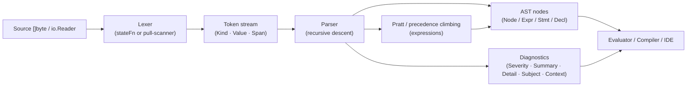

# Building Lexers and Parsers in Go (for Arbitrary Target Grammars)

> **Implementation language: Go. Target language: arbitrary — not Go itself.**

---

## Executive Summary

Go's standard library, combined with a small ecosystem of well-maintained third-party libraries,
provides everything needed to hand-craft or generate a production-quality lexer and parser for
any target grammar. Hand-written lexers in Go follow two proven idioms: Rob Pike's `stateFn`
coroutine pattern (canonical in `text/template`) and the simpler imperative pull-scanner
(`go/scanner` style). Parsers are typically recursive-descent combined with precedence climbing
or Pratt (TDOP) for expressions. For teams preferring grammar-file tooling, five mature options
cover the full spectrum: goyacc (LALR(1)), ANTLR4 (ALL(*)), pigeon (PEG/packrat), participle
(runtime recursive-descent with limited lookahead), and pointlander/peg (packrat PEG). For
editor-integration and incremental reparsing the only production-grade Go option requires CGo
via `github.com/tree-sitter/go-tree-sitter`. The key engineering tensions are: compile-time code
generation vs. runtime reflection; scannerless vs. lexer-first; panic-and-recover vs.
accumulate-and-return for error handling; and whether to pay the Java build-time cost of ANTLR.

---

## Scope and Assumptions

- **Implementation language**: Go (any version ≥ 1.21 for generics-aware libraries).
- **Target grammar**: arbitrary — a DSL, config format, expression language, or other non-Go
  language. None of the techniques below are specific to Go syntax.
- **Input encoding**: UTF-8 byte slices (`[]byte`) or `io.Reader`; UTF-16 is not treated as a
  first-class case (convert first).
- **Out of scope**: parsing Go source itself (`go/parser` already does that perfectly); WASM
  targets; purely theoretical grammar formalisms.

---

## Decision Guide / Recommended Defaults

| Situation | Recommended Approach |
|---|---|
| New DSL, rapid prototype | **participle v2** — no code generation, grammar-as-struct-tags, good error messages |
| DSL with complex expression grammar | **Hand-written RD + Pratt** (blueprint in §9) |
| Porting an existing yacc/bison grammar | **goyacc** |
| Large language, want best error recovery | **ANTLR4** (requires Java at build time) |
| Config format, scannerless PEG suits it | **pigeon** |
| Editor / LSP, existing language | **tree-sitter/go-tree-sitter** (CGo required) |
| Simple tokenizer, C/Go-like literals | **text/scanner** (tokenizer, not a full parser) |
| Highest throughput, full control | **Hand-written pull scanner + hand-written RD parser** |

**Default for a new project**: start with a hand-written pull-scanner (§6) and recursive-descent
parser with Pratt expressions (§7). Migrate to participle if grammar complexity stays low; switch
to ANTLR if you need best-in-class error recovery or an existing `.g4` grammar.

---

## Architecture Overview



Optional code-generation path (goyacc / ANTLR4 / pigeon / pointlander/peg) replaces the
hand-written parser but uses the same `Source → Token → AST → Consumer` pipeline shape.

---

## Lexer Design

### 6.1  The `stateFn` Pattern (Rob Pike, 2011)

The canonical Go lexer pattern is: *a state is a function that returns its own successor*.
The state machine runs without an explicit table or switch on state IDs.[^1]

```go
// QUOTED – golang/go:src/text/template/parse/lex.go:94–95
// (SHA a00f48e658ab64827ce51441787ac5af0f6921c2)
type stateFn func(*lexer) stateFn
```

The modern stdlib implementation runs the state loop **synchronously** inside `nextItem()`,
called by the parser one token at a time. The goroutine + channel design from Pike's 2011
GTUG Sydney talk is *not* what the current production code uses.[^2] `authzed/spicedb` is
one of the few production codebases that does run `go l.run()` in a goroutine, using an
unbuffered channel with a `closed` sentinel for clean shutdown.[^3]

**Minimal canonical lexer struct** (stdlib):

```go
// QUOTED – golang/go:src/text/template/parse/lex.go:96–114
type lexer struct {
    name      string
    input     string
    pos       Pos   // current byte position
    start     Pos   // start of current token
    line      int   // 1-based
    startLine int
    item      item  // most recent item (avoids channel)
    atEOF     bool
}
```

**Key cursor primitives** (all verified against source):

- `next() rune` — `utf8.DecodeRuneInString(l.input[l.pos:])`, advances `pos` and increments
  `line` on `'\n'`.[^4]
- `backup()` — uses `utf8.DecodeLastRuneInString(l.input[:l.pos])` to correctly step back
  over multi-byte sequences; can only be called once per `next()`.[^5]
- `emit(t itemType)` — slices `input[start:pos]` **zero-copy** and resets `start`.[^6]
- `errorf(...)` — emits error token and sets `input` to empty, terminating the loop by
  returning `nil`.[^7]
- `accept(valid string) / acceptRun(valid string)` — structured consumption helpers.[^8]

**Keyword disambiguation**: after scanning an identifier, check a `map[string]itemType`
built in `init()`.[^9] For ≤12 keywords a `switch` is faster; for larger sets a map
wins.[^10]

### 6.2  Pull-Scanner / Imperative Style

`go/scanner` takes a different architecture: a single large `Scan()` method dispatches on
the current byte via a `switch`. It accepts `[]byte` (not `io.Reader`), enabling zero-copy
token slices and a byte-level ASCII fast path in `scanIdentifier()`.[^11]

```go
// QUOTED – golang/go:src/go/scanner/scanner.go:56–92
// ASCII fast-path: treat high byte as rune only when b >= utf8.RuneSelf
func (s *Scanner) next() {
    if s.rdOffset < len(s.src) {
        s.offset = s.rdOffset
        r, w := rune(s.src[s.rdOffset]), 1
        if r >= utf8.RuneSelf {
            r, w = utf8.DecodeRune(s.src[s.rdOffset:])
        }
        s.rdOffset += w
        s.ch = r
    } else {
        s.offset = len(s.src); s.ch = eof
    }
}
```

The `peek() byte` method (not `peek() rune`) enables single-byte lookahead without
decoding a full rune — important for assembling multi-character operators.[^12]

### 6.3  `text/scanner` as a Configurable Tokenizer

`text/scanner` is a **streaming tokenizer** (accepts `io.Reader`), not a parser.[^13] Its
defaults follow Go lexical rules but four public fields reshape it for arbitrary DSLs:

| Field | Purpose |
|---|---|
| `Mode uint` | Bitmask: which token classes (`ScanIdents`, `ScanFloats`, …) to recognise |
| `Whitespace uint64` | Bitmask of chars ≤ U+0020 to skip silently |
| `IsIdentRune func(ch rune, i int) bool` | Custom identifier alphabet |
| `Error func(s *Scanner, msg string)` | Error callback (default: stderr) |

`GoTokens` is `ScanIdents|ScanFloats|ScanChars|ScanStrings|ScanRawStrings|ScanComments|SkipComments`.
Note: `ScanFloats` activates integer scanning too; set `ScanInts` alone only if you want
integers but not floats.[^14]

The Go assembler (`cmd/asm`) is the authoritative non-Go example: it drives `text/scanner`
for Plan 9 assembly syntax, sets `Whitespace` to exclude `'\n'` (statement separator),
and uses a custom `IsIdentRune` that accepts the centre-dot `·` (U+00B7) and division-slash
`∕` (U+2215) for runtime symbol paths.[^15]

Multi-character operators are assembled in the caller via `Scan()` + `Peek()` + `Next()`.[^16]

**Limitations**: `Whitespace` only covers code points ≤ U+0020 (documented: "behaviour
undefined for values ch > ' '"); comment syntax is fixed to `//` and `/* */`; no built-in
keyword recognition; tokens above U+0020 used as delimiters must be handled by the
caller.[^17]

**Use `text/scanner` when** your DSL shares C/Go literal syntax and the four configuration
knobs are sufficient. **Use a hand-written lexer when** you need non-ASCII whitespace,
non-`//`/`/* */` comments, custom string delimiters, string interpolation/heredocs, or a
closed token-type enum.[^18]

### 6.4  Unicode and UTF-8 Details

- Always test `b >= utf8.RuneSelf` (0x80) before calling `utf8.DecodeRune`; the ASCII
  fast-path is significant on typical source files.[^19]
- `utf8.RuneError` with width 1 = invalid byte sequence; width > 1 = valid U+FFFD.
- Reject NUL explicitly — `case r == 0: s.error(...)` — before the `>= utf8.RuneSelf`
  branch. Many downstream consumers assume C-string safety.[^20]
- BOM: silently strip one UTF-8 BOM at byte offset 0; emit a distinct error for subsequent
  BOMs and for UTF-16 BOMs (`0xFE 0xFF` / `0xFF 0xFE`).[^21]
- `unicode.IsLetter(b)` called on a raw byte ≥ 0x80 gives wrong results; always decode to
  a full `rune` first.[^22]

### 6.5  Token/Span Model

**`go/token` compact design**: `token.Pos` is a single `int` encoding `fileBase + byteOffset`.
Converting to `(filename, line, col)` does a binary search over a `[]int` of newline
offsets.[^23] Column is a **byte** count from line start (documented).[^24]

**HCL eager design**: every `Pos` stores `{Line int, Column int, Byte int}` directly, so
spans are self-contained without a FileSet lookup.[^25] Column is grapheme-cluster count
via `go-textseg`. `Range{Start, End Pos}` is the span type; `SliceBytes([]byte)` safely
extracts token text.[^26]

**Recommendation** (synthesised): for new projects, prefer the HCL model — store
`{File, Line, Column, Byte}` eagerly in every token. Use byte offset as the authoritative
field for all slicing; compute line/column lazily only for error messages. Add a
`SpanBetween(a, b Span) Span` utility.[^27]

> **SYNTHESIZED token/pos.go** (derived from HCL pos.go and stdlib token.go patterns):
>
> ```go
> // [SYNTHESIZED]
> package token
>
> type Pos struct {
>     File   string
>     Line   int  // 1-based
>     Column int  // 1-based, rune count
>     Byte   int  // 0-based byte offset (authoritative)
> }
>
> type Span struct{ Start, End Pos } // half-open [Start, End)
>
> func SpanBetween(a, b Span) Span { return Span{Start: a.Start, End: b.End} }
> func (s Span) Contains(p Pos) bool { return p.Byte >= s.Start.Byte && p.Byte < s.End.Byte }
>
> type Kind int
>
> const (
>     ILLEGAL Kind = iota
>     EOF; COMMENT; NEWLINE; SYNTHETIC_SEMI
>     literal_beg
>     IDENT; INT; FLOAT; STRING
>     literal_end
>     operator_beg
>     PLUS; MINUS; STAR; SLASH; PERCENT
>     EQ; NEQ; LT; LE; GT; GE; ASSIGN
>     AND; OR; BANG
>     operator_end
>     keyword_beg
>     // ... your keywords here
>     keyword_end
> )
>
> func (k Kind) IsLiteral()  bool { return literal_beg  < k && k < literal_end }
> func (k Kind) IsOperator() bool { return operator_beg < k && k < operator_end }
> func (k Kind) IsKeyword()  bool { return keyword_beg  < k && k < keyword_end }
>
> type Token struct { Kind Kind; Value string; Span Span }
> ```

The sentinel-range `iota` pattern (with unexported `literal_beg`/`literal_end` sentinels)
comes directly from `go/token/token.go`.[^28]

---

## Parser Design

### 7.1  Recursive Descent

**Structure**: one `parser` struct holds the lexer, one-token lookahead (sometimes two or
three), an error accumulator, and a nesting-depth counter:

```go
// QUOTED (condensed) – golang/go:src/go/parser/parser.go:41–75
type parser struct {
    file    *token.File
    errors  scanner.ErrorList
    scanner scanner.Scanner
    pos token.Pos; tok token.Token; lit string
    syncPos token.Pos; syncCnt int
    nestLev int
}
```

**Multi-token lookahead**: `text/template` uses a `[3]item` array with `peekCount`; no
allocation.[^29]

**Error handling — two strategies**:

1. *Panic + recover* (`text/template`, `blues/jsonata-go`): `errorf` panics with a typed
   value; top-level `Parse()` uses `defer recover()` and re-panics real `runtime.Error`
   values.[^30]
2. *Accumulate + return* (`go/parser`, HCL): every `parse*` method returns
   `(Node, Diagnostics)`; errors are appended but parsing continues.[^31]

**Anti-stack-overflow guard**:[^32]

```go
// QUOTED – golang/go:src/go/parser/parser.go:123–138
const maxNestLev int = 1e5

func incNestLev(p *parser) *parser {
    p.nestLev++
    if p.nestLev > maxNestLev { p.error(p.pos, "exceeded max nesting depth"); panic(bailout{}) }
    return p
}
// Usage pattern: defer decNestLev(incNestLev(p))
```

**Tracing (non-production mode)**:[^33]

```go
// QUOTED – golang/go:src/go/parser/parser.go (~line 108)
func trace(p *parser, msg string) *parser { p.printTrace(msg, "("); p.indent++; return p }
func un(p *parser) { p.indent--; p.printTrace(")") }
// In each parse func: if p.trace { defer un(trace(p, "SomeProd")) }
```

**Error recovery — token-set synchronization**:[^34]

```go
// QUOTED – golang/go:src/go/parser/parser.go:399–427
func (p *parser) advance(to map[token.Token]bool) {
    for ; p.tok != token.EOF; p.next() {
        if to[p.tok] {
            if p.pos == p.syncPos && p.syncCnt < 10 { p.syncCnt++; return }
            if p.pos > p.syncPos { p.syncPos = p.pos; p.syncCnt = 0; return }
        }
    }
}
```

The `syncCnt < 10` guard prevents infinite loops when two recovery routines call each
other at the same bad token position.

**Error count limit** (`go/parser`): after 10 errors on different lines, `bailout{}` is
panicked and caught at `ParseFile`'s `defer recover()`; one error per line is
deduplicated.[^35]

### 7.2  Precedence Climbing

Precedence climbing encodes operator precedence as a minimum-precedence argument passed
recursively. Left-associativity is `q += 1`; right-associativity omits the increment.

`go/parser` carries precedence on the token type itself:[^36]

```go
// QUOTED – golang/go:src/go/token/token.go:184–200
func (op Token) Precedence() int {
    switch op {
    case LOR:                                   return 1
    case LAND:                                  return 2
    case EQL, NEQ, LSS, LEQ, GTR, GEQ:         return 3
    case ADD, SUB, OR, XOR:                     return 4
    case MUL, QUO, REM, SHL, SHR, AND, AND_NOT: return 5
    }
    return LowestPrec // 0
}
```

`parseBinaryExpr` passes `oprec + 1` when recursing, enforcing left-associativity.[^37]
`gorilla/sadbox` uses a separate `precedence map[tokenType]int` and a
`rightAssociativity map[tokenType]bool`; left-associativity is `if !rightAssociativity[t.typ] { q += 1 }`.[^38]

### 7.3  Pratt (TDOP) Parsing

Pratt parsing assigns every token a *binding power* (bp) and two optional handler
functions:

- **nud** ("null denotation"): token in prefix position → AST node
- **led** ("left denotation"): token in infix position + left node → new node

`blues/jsonata-go` is the most faithful Go Pratt implementation found, with fixed-size
arrays indexed by token type for O(1) dispatch:[^39]

```go
// QUOTED (condensed) – blues/jsonata-go:jparse/jparse.go:52–95
var nuds = [...]nud{ typeString: parseString, typeMinus: parseNegation, ... }
var leds = [...]led{ typePlus: parseNumericOperator, typeDot: parseDot, ... }

// Binding-power table – QUOTED – blues/jsonata-go:jparse/jparse.go:100–140
var bps = initBindingPowers([][]tokenType{
    {typeParenOpen, typeBracketOpen},          // highest
    {typeDot}, {typeBraceOpen},
    {typeMult, typeDiv, typeMod},
    {typePlus, typeMinus, typeConcat},
    {typeEqual, typeNotEqual, typeLess, ...},
    {typeAnd}, {typeOr}, {typeCondition},
    {typeAssign},                              // lowest
})
// initBindingPowers assigns bp = (len(groups) - offset) * 10
```

**Core Pratt loop** (QUOTED):[^40]

```go
func (p *parser) parseExpression(rbp int) Node {
    if p.token.Type == typeEOF { panic(newError(ErrUnexpectedEOF, p.token)) }
    t := p.token; p.advance(false)
    nud := p.lookupNud(t.Type)
    if nud == nil { panic(newError(ErrPrefix, t)) }
    lhs, _ := nud(p, t)
    for rbp < p.lookupBp(p.token.Type) {
        t = p.token; p.advance(true)
        led := p.lookupLed(t.Type)
        lhs, _ = led(p, t, lhs)
    }
    return lhs
}
```

**Go-specific initialisation-loop issue**: `nuds`/`leds` contain functions that call
`parseExpression`, which in turn calls `lookupNud`/`lookupLed`. This creates a
compile-time global-var cycle. Solution: store lookup functions as struct fields assigned
at runtime in `newParser()`.[^41]

**Right-associativity in Pratt**: the `led` for a right-associative operator (e.g., `**`)
recursively calls `parseExpression(bp - 1)` rather than `parseExpression(bp)`. The
`gorilla/sadbox` equivalent: omit `q += 1` when the operator is right-associative.[^42]

> **SYNTHESIZED Pratt implementation** (derived from blues/jsonata-go and gorilla/sadbox):
>
> ```go
> // [SYNTHESIZED] parser/pratt.go
> type nudFn func(p *parser, tok token.Token) ast.Expr
> type ledFn func(p *parser, tok token.Token, left ast.Expr) ast.Expr
>
> type opEntry struct { bp int; rightAssoc bool; led ledFn }
>
> type prattTable struct {
>     nuds map[token.Kind]nudFn
>     ops  map[token.Kind]opEntry
> }
>
> func newPrattTable() *prattTable {
>     pt := &prattTable{
>         nuds: map[token.Kind]nudFn{
>             token.INT:    parseIntLit,
>             token.FLOAT:  parseFloatLit,
>             token.STRING: parseStrLit,
>             token.IDENT:  parseIdent,
>             token.LPAREN: parseGrouped,
>             token.MINUS:  parsePrefixMinus,
>             token.BANG:   parsePrefixBang,
>         },
>         ops: map[token.Kind]opEntry{
>             token.OR:     {bp: 10, led: parseBinOp},
>             token.AND:    {bp: 20, led: parseBinOp},
>             token.EQ:     {bp: 30, led: parseBinOp},
>             token.NEQ:    {bp: 30, led: parseBinOp},
>             token.LT:     {bp: 30, led: parseBinOp},
>             token.LE:     {bp: 30, led: parseBinOp},
>             token.GT:     {bp: 30, led: parseBinOp},
>             token.GE:     {bp: 30, led: parseBinOp},
>             token.PLUS:   {bp: 40, led: parseBinOp},
>             token.MINUS:  {bp: 40, led: parseBinOp},
>             token.STAR:   {bp: 50, led: parseBinOp},
>             token.SLASH:  {bp: 50, led: parseBinOp},
>             token.PERCENT:{bp: 50, led: parseBinOp},
>             // right-assoc exponentiation: token.STARSTAR:{bp:60, rightAssoc:true, led:parseBinOp},
>         },
>     }
>     return pt
> }
>
> // parseExpr: Pratt core loop. Errors return *ast.BadExpr, do NOT panic.
> func (pt *prattTable) parseExpr(p *parser, rbp int) ast.Expr {
>     if p.at(token.EOF) {
>         p.errorf(p.cur.Span, "unexpected end of input")
>         return &ast.BadExpr{Span: p.cur.Span}
>     }
>     tok := p.advance()
>     nud, ok := pt.nuds[tok.Kind]
>     if !ok {
>         p.errorf(tok.Span, "unexpected token %q in expression", tok.Value)
>         return &ast.BadExpr{Span: tok.Span}
>     }
>     lhs := nud(p, tok)
>     for {
>         op, ok := pt.ops[p.cur.Kind]
>         if !ok || op.bp <= rbp { break }
>         tok = p.advance()
>         lhs = parseBinOp(p, tok, lhs, pt, op)
>     }
>     return lhs
> }
>
> func parseBinOp(p *parser, tok token.Token, left ast.Expr,
>     pt *prattTable, op opEntry) ast.Expr {
>     rbp := op.bp
>     if op.rightAssoc { rbp-- } // right-assoc: allow equal-bp on right side
>     right := pt.parseExpr(p, rbp)
>     return &ast.BinaryExpr{
>         Span:  token.SpanBetween(left.GetSpan(), right.GetSpan()),
>         Left:  left, Op: tok, Right: right,
>     }
> }
> ```

### 7.4  AST Design

Go stdlib uses three marker interfaces (`Node`, `Expr`, `Stmt`, `Decl`) with unexported
tag methods (`exprNode()`, etc.) that prevent spurious implementations.[^43]
`BadExpr`/`BadStmt`/`BadDecl` nodes carry spans and signal parse errors in the
tree.[^44]

`blues/jsonata-go` adds an `optimize() (Node, error)` hook enabling a constant-folding
pass after parsing, without a separate AST walker.[^45]

### 7.5  Diagnostics

HCL's `Diagnostic` struct is the most production-ready model found:[^46]

```go
// QUOTED – hashicorp/hcl:diagnostic.go:25–64
type Diagnostic struct {
    Severity DiagnosticSeverity  // DiagError | DiagWarning
    Summary  string              // short, one-line
    Detail   string              // multi-sentence explanation + hints
    Subject  *Range              // tight span (the bad token) → squiggle
    Context  *Range              // wider enclosing construct
    Extra    interface{}         // machine-readable extension
}
```

`Subject` / `Context` dual-range directly maps to rustc-style error display.
`checkInvalidTokens` runs as a pre-parser pass, recognising tokens that are never
valid (bitwise `&`, apostrophe, smart quotes, bad UTF-8) and generating targeted
messages.[^47]

**Column semantics matter**: `go/token.Position.Column` is a byte count;
`text/scanner.Position.Column` is a rune count; `hcl.Pos.Column` is a grapheme-cluster
count. Decide once, document it, never mix.[^48]

---

## Tooling Alternatives

### 8.1  goyacc — LALR(1) Generator

**Import**: `golang.org/x/tools/cmd/goyacc` [^49]

LALR(1) grammar in `.y` files, generated entirely at build time. The generated parser is
a table-driven shift/reduce loop — O(n) with no reflection. You write your own lexer
implementing:[^50]

```go
// QUOTED – golang/tools:cmd/goyacc/doc.go:28–34
type yyLexer interface {
    Lex(lval *yySymType) int  // return token id; 0 = EOF
    Error(e string)
}
```

Semantic actions use C-style `$$`/`$1`/`$2` notation inline in grammar rules; no
automatic AST construction. Error recovery uses the `error` pseudo-terminal (yacc
panic-mode: consume until a synchronisation token). `//go:generate goyacc -o expr.go
-p "expr" expr.y` is standard.[^51]

**Fits**: unambiguous LALR(1) grammars; porting existing yacc/bison grammars; maximum
parse speed. **Does not fit**: ambiguous grammars with unresolvable conflicts; context-
sensitive lexing; rapid prototyping.

### 8.2  ANTLR4 — ALL(*) Generator

**Runtime import**: `github.com/antlr4-go/antlr/v4` (canonical since v4.13.0; old path
`github.com/antlr/antlr4/runtime/Go/antlr/v4` is superseded).[^52]

Grammar in `.g4` files. **Java is required at build time only** — it is a code generator,
not a runtime dependency.[^53] The Go runtime is a pure-Go library (one transient dep:
`golang.org/x/exp`). Generated code implements ATN-driven ALL(*) prediction with DFA
caching.

Error recovery is best-in-class: `DefaultErrorStrategy` performs single-token insertion,
single-token deletion, and resync-to-follow-set. `ErrorListener` provides structured
callbacks for all recovery events.[^54] `grammars-v4` (`antlr/grammars-v4`) supplies
hundreds of ready-to-use `.g4` files for SQL dialects, C/C++, Python, Java, etc.

**Fits**: large complex languages; existing `.g4` grammars; multiple language targets;
best error recovery. **Does not fit**: Java-free build environments; small DSLs where
generated boilerplate is disproportionate.

### 8.3  pigeon — PEG Code Generator

**Import**: `github.com/mna/pigeon`[^55] (v1 is current; v2 is **not released** as of
June 2026).[^56]

Generates a single self-contained Go file from a `.peg` grammar (PEG.js-inspired
syntax). Scannerless: operates directly on `[]byte`. Full backtracking via
`savepoint{position, rn, w}` structs.[^57] Packrat memoization is opt-in via
`Memoize(true)` or `-cache` flag; without it, worst-case is O(2ⁿ) on pathological
grammars.[^58]

**Left recursion**: pigeon provides experimental support under the `-support-left-recursion`
flag using Tarjan SCC detection + the Warth/Wimmer/Reps "growing-the-seed" algorithm.
This is **not** a claim that all PEG parsers reject left recursion absolutely; it is a
pigeon-specific extension with limitations.[^59] Grammars where no single "leader" rule
participates in all cycles fail with `ErrNoLeader`.[^60]

Error recovery uses "failure labels" (`throw`/`recover` blocks) from Maidl et al.[^61]

`-optimize-basic-latin` (ASCII lookup table), `-optimize-grammar` (rule inlining,
deduplication), and `-optimize-parser` (removes debug overhead) are build-time
performance flags.[^62]

**Fits**: scannerless grammars; self-contained generated output; PEG ordered-choice
semantics. **Does not fit**: grammars with left-recursion beyond pigeon's experimental
support; performance-critical parsing of large inputs without careful flag tuning.

### 8.4  participle v2 — Runtime Recursive Descent

**Import**: `github.com/alecthomas/participle/v2`[^63]

participle is **not a true PEG parser**. It is a runtime recursive-descent library with
configurable limited-lookahead ordered choice. Key distinctions:[^64]

- Requires an explicit separate lexer (not scannerless)
- No packrat memoization
- `|` in struct tags commits after `useLookahead` tokens consumed (default: 1 token)
- **No left recursion support** — left-recursive grammars cause infinite recursion[^65]

Grammar is expressed in Go struct field tags; `Build[G]()` reflects on the struct at
startup (one-time cost); all subsequent parses are reflection-free.[^66]

Three bundled lexer options: default `text/scanner`-based; `lexer.MustSimple([]SimpleRule{...})`
(ordered regex rules); `lexer.MustStateful(Rules{...})` (Push/Pop state machine for
string interpolation, heredocs).[^67]

`UseLookahead(participle.MaxLookahead)` (99999) gives pseudo-unlimited backtracking at
the cost of potentially misleading error messages at low-lookahead failures.[^68]

Error reporting: deepest-cursor error position with "unexpected token X (expected Y)"
format.[^69]

**Fits**: DSLs, config formats (HCL, TOML, INI, Protobuf IDL), rapid prototyping,
stateful string interpolation. **Does not fit**: left-recursive grammars; fine-grained
per-rule semantic actions; error recovery.

### 8.5  Official Tree-Sitter Binding — `github.com/tree-sitter/go-tree-sitter`

**This is the official binding**, maintained by the tree-sitter org.[^70] The older
`smacker/go-tree-sitter` binding should be avoided for new projects: it contains a
confirmed bug where `new_end_point` is set from `i.OldEndPoint` instead of
`i.NewEndPoint` in its `EditInput.c()` bridge — silently corrupting multi-line edit
incremental reparsing.[^71] It also uses deprecated `ts_parser_set_timeout_micros` and
`ts_parser_set_cancellation_flag` APIs.[^72]

**CGo is mandatory** — no pure-Go path exists.[^73] The binding vendors the C tree-sitter
runtime directly.

**Manual lifecycle management is required**: due to a known `runtime.SetFinalizer`/CGo
interaction bug, the official binding does NOT set finalizers. Callers must call
`Close()` on every `Parser`, `Tree`, `TreeCursor`, `Query`, `QueryCursor`, and
`LookaheadIterator`.[^74]

Incremental reparse protocol (three steps):[^75]

1. `tree.Edit(&InputEdit{StartByte, OldEndByte, NewEndByte, StartPosition, OldEndPosition, NewEndPosition})`
2. `newTree := parser.Parse(newSource, tree)` — reuses unchanged subtrees
3. `tree.ChangedRanges(newTree)` — returns minimal set of syntactically changed ranges

No conventional Go parser library (`go/parser`, ANTLR4, participle, pigeon) supports
incremental reparsing. Tree-sitter (via CGo) is the only production option.[^76]

Grammar authoring requires Node.js + the `tree-sitter generate` CLI. 100+ pre-built
grammars exist in the `tree-sitter/` GitHub org.[^77]

**Fits**: editor/LSP integration; existing languages with a tree-sitter grammar;
incremental reparsing; error-tolerant parsing (always produces a complete CST with
MISSING/ERROR nodes). **Does not fit**: pure-Go builds; defining novel grammars entirely
in Go.

### 8.6  pointlander/peg — Packrat-Always PEG Generator

**Import**: `github.com/pointlander/peg`[^78] Memoization is always on in AST mode
(backed by `map[memoKey{rule,pos}]memo{Matched,[]token}`). Grammar syntax inherits from
Ian Piumarta's C `peg/leg`. Actions execute **post-parse** in `Execute()`, not during the
parse — semantic predicates cannot influence parsing decisions.[^79] No left-recursion
support.[^80] Documentation is sparse compared to pigeon.

---

## End-to-End Implementation Blueprint

The following synthesized interfaces and stubs collect the patterns above into a minimal
compile-plausible skeleton. These are **SYNTHESIZED** — not verbatim source — but derived
directly from verified production code.

```go
// [SYNTHESIZED] Complete package layout
// mylang/token/  – Kind, Token, Pos, Span (§6.5 above)
// mylang/lexer/  – Lexer struct + Next()
// mylang/ast/    – Node, Expr, Stmt, Decl, concrete types
// mylang/parser/ – Parser struct + public Parse()
// mylang/diagnostic/ – Diagnostic, Diagnostics

// [SYNTHESIZED] lexer/lexer.go – pull-scanner (Pattern B from §6.2)
package lexer

import ("unicode/utf8"; "mylang/token")

const eof = rune(-1)

type Lexer struct {
    src          string
    file         string
    start, pos   int    // byte offsets
    width        int    // byte width of last decoded rune
    line, col    int    // 1-based line, rune-count column (current)
    sLine, sCol  int    // line/col at token start
}

func New(file, src string) *Lexer {
    return &Lexer{src: src, file: file, line: 1, col: 1, sLine: 1, sCol: 1}
}

func (l *Lexer) next() rune {
    if l.pos >= len(l.src) { l.width = 0; return eof }
    r, w := utf8.DecodeRuneInString(l.src[l.pos:])
    l.width = w; l.pos += w
    if r == '\n' { l.line++; l.col = 1 } else { l.col++ }
    return r
}
func (l *Lexer) peek() rune  { r := l.next(); l.backup(); return r }
// backup may only be called once per next(); col tracking omitted for brevity
func (l *Lexer) backup()     { l.pos -= l.width }
func (l *Lexer) ignore()     { l.start = l.pos; l.sLine = l.line; l.sCol = l.col }
func (l *Lexer) makeToken(k token.Kind) token.Token {
    t := token.Token{Kind: k, Value: l.src[l.start:l.pos],
        Span: token.Span{
            Start: token.Pos{File: l.file, Line: l.sLine, Column: l.sCol, Byte: l.start},
            End:   token.Pos{File: l.file, Line: l.line,  Column: l.col,  Byte: l.pos},
        }}
    l.start = l.pos; l.sLine = l.line; l.sCol = l.col
    return t
}

// Next returns the next token. Returns token.EOF when exhausted.
func (l *Lexer) Next() token.Token { /* dispatch on l.peek() */ }


// [SYNTHESIZED] diagnostic/diagnostic.go – HCL-inspired (§7.5)
package diagnostic

import "mylang/token"

type Severity int
const (Error Severity = iota + 1; Warning)

type Diagnostic struct {
    Severity Severity
    Summary  string
    Detail   string
    Subject  *token.Span  // tight range for squiggle underline
    Context  *token.Span  // broader enclosing construct
}
type Diagnostics []*Diagnostic

func (d Diagnostics) HasErrors() bool {
    for _, x := range d { if x.Severity == Error { return true } }
    return false
}
func (d *Diagnostics) Errorf(span token.Span, summary, detail string) {
    *d = append(*d, &Diagnostic{Severity: Error, Summary: summary,
        Detail: detail, Subject: &span})
}


// [SYNTHESIZED] parser/parser.go – accumulate-and-return errors
package parser

import ("mylang/ast"; "mylang/diagnostic"; "mylang/lexer"; "mylang/token")

type parser struct {
    lex    *lexer.Lexer
    cur    token.Token   // current (just consumed)
    peek   token.Token   // one-ahead lookahead
    errors diagnostic.Diagnostics
    nestLev int
}

const maxNestLev = 100_000  // mirrors go/parser constant

func New(l *lexer.Lexer) *parser {
    p := &parser{lex: l}
    p.advance(); p.advance()   // prime cur and peek
    return p
}

func (p *parser) advance() token.Token {
    prev := p.cur; p.cur = p.peek; p.peek = p.lex.Next(); return prev
}
func (p *parser) at(k token.Kind) bool { return p.cur.Kind == k }
func (p *parser) expect(k token.Kind) token.Token {
    if p.at(k) { return p.advance() }
    p.errors.Errorf(p.cur.Span, "syntax error",
        "expected "+k.String()+", got "+p.cur.Kind.String())
    return p.cur
}
func (p *parser) errorf(span token.Span, summary, detail string) {
    p.errors.Errorf(span, summary, detail)
}
func (p *parser) incNest() { p.nestLev++; if p.nestLev > maxNestLev {
    panic("exceeded max nesting depth") } }
func (p *parser) decNest() { p.nestLev-- }

// Public API – mirrors go/parser.ParseFile contract
func Parse(filename string, src []byte) (*ast.File, diagnostic.Diagnostics) {
    l := lexer.New(filename, string(src))
    p := New(l)
    f := p.parseFile()
    return f, p.errors
}
```

---

## Testing, Fuzzing, Benchmarking, and Security/Resource Limits

### 10.1  Native Go Fuzzing (Go ≥ 1.18)

The `testing.F` API is the current standard. CUE's scanner uses the older go-fuzz API
(`Fuzz(b []byte) int`).[^81]

Key fuzz invariants for any parser:[^82]
1. Must never panic on any input (wrap public API in `recover` in the fuzz harness)
2. Must always terminate
3. Every token's byte range must be within `[0, len(src)]`
4. Token ranges must be non-overlapping and in order
5. `parse(print(parse(src))) == parse(src)` (round-trip idempotence)

Seed corpus: valid inputs, empty input, NUL byte, UTF-16 BOM (`\xFF\xFE`), invalid UTF-8,
deeply nested expressions, very long identifiers.[^83]

### 10.2  Golden-File Tests

Pattern from `touchmarine/to`:[^84]

```go
// QUOTED – touchmarine/to:parser/parser_test.go:18–21
var update = flag.Bool("update", false, "update golden files")
// In test body: if *update { os.WriteFile(goldenPath, []byte(result), 0644) }
// Else: compare result against committed golden file in testdata/
```

Prefer token-stream serialization (one `kind:offset:len:value` per line) over full AST
dumps — less brittle to AST field additions.

### 10.3  Error-Annotation Tests

`go/parser/error_test.go` embeds expected errors as regex comments in source:[^85]

```go
// QUOTED – golang/go:src/go/parser/error_test.go:19–29
// _ = x /* ERROR "not declared" */ + 1
var errRx = regexp.MustCompile(`^/\* *ERROR *(HERE|AFTER)? *"([^"]*)" *\*/$`)
```

Co-locating expected errors with the problematic input dramatically improves test
maintainability.

### 10.4  Benchmarking

```go
// QUOTED (condensed) – golang/go:src/go/scanner/scanner_test.go:906–954
func BenchmarkScan(b *testing.B) {
    b.SetBytes(int64(len(source)))  // enables MB/s reporting
    var s Scanner
    for i := 0; i < b.N; i++ {
        s.Init(file, source, nil, ScanComments)  // reuse Scanner value
        for { _, tok, _ := s.Scan(); if tok == token.EOF { break } }
    }
}
```

Key patterns:[^86]
- `b.SetBytes` for throughput in MB/s
- Scanner struct as value, `Init()` for reuse — zero scanner allocation per file
- `string(src[start:end])` at most once per token (one allocation)
- ASCII byte-loop fast path before any Unicode operation
- Profile with `go tool pprof`; watch for `runtime.slicebytetostring` calls

### 10.5  Security and Resource Limits

| Limit | Verified pattern | Source |
|---|---|---|
| Max nesting depth | `maxNestLev = 1e5` + `panic(bailout{})` | `golang/go:src/go/parser/parser.go:123–138`[^87] |
| Max error count | 10 errors → `bailout`; catch in `defer recover()` | `golang/go:src/go/parser/parser.go:279–299`[^88] |
| Line/col overflow | `const maxLineCol = 1 << 30` for `//line` directives | `golang/go:src/go/scanner/scanner.go:272–274`[^89] |
| Max input size | No stdlib limit; add manually for untrusted input | Synthesized: `if len(src) > 10<<20 { return err }` |
| Max tokens | HCL pattern: cap at 1,000,000 tokens before OOM | `hashicorp/hcl:hclsyntax/scan_tokens.rl`[^90] |
| Anti-loop guard | `syncCnt < 10` before consuming same-position token | `golang/go:src/go/parser/parser.go:399–427`[^91] |

---

## Common Failure Modes

| Mode | Root cause | Mitigation |
|---|---|---|
| Wrong column for multi-byte chars | Byte-offset used as rune column (or vice versa) | Decide byte vs. rune vs. grapheme once; document; never mix[^92] |
| Parser infinite loop on bad input | `advance()` called at same position repeatedly | `syncPos`/`syncCnt` guard[^93] |
| Stack overflow on deep nesting | Recursive descent without depth limit | `nestLev` counter → `panic(bailout{})`[^94] |
| Error cascade (100 errors for one typo) | Each recovery miss emits its own error | `recovery` bool flag (HCL); `RemoveMultiples()` (go/scanner)[^95] |
| UTF-16 BOM misidentified | `0xFF 0xFE` decoded as invalid UTF-8 | Explicit "got UTF-16" error; consume all input[^96] |
| NUL byte silently accepted | `rune(0)` is valid; no explicit check | `case r == 0: emit error` before Unicode branch[^97] |
| Pratt right-assoc broken | Left-assoc `bp` passed when right-assoc `bp-1` needed | Use `if op.rightAssoc { rbp-- }` in `parseBinOp`[^98] |
| iota sentinel values wrong | Blank-identifier sentinels (e.g., `_ = iota`) cause off-by-one | Use named unexported sentinels (`literal_beg`) as in go/token[^99] |
| `AddLine` called with wrong offset | Using `rdOffset` (post-advance) instead of `offset` (start of `\n`) | Check `s.ch == '\n'` at start of `next()`, before incrementing `offset`[^100] |
| Pratt init cycle | `nuds`/`leds` globals reference functions that call `parseExpression` | Assign lookup functions as struct fields at runtime[^101] |
| CGo tree-sitter: leaked tree | No finalizer in official binding | Always `defer parser.Close()` / `defer tree.Close()`[^102] |
| smacker `new_end_point` bug | `OldEndPoint` used for both old and new end | Migrate to `github.com/tree-sitter/go-tree-sitter`[^103] |

---

## Key Repositories Summary Table

| Repository | Module / Import | Algorithm | CGo | Code gen | Left recursion |
|---|---|---|---|---|---|
| `golang/go` | `go/scanner`, `text/scanner`, `go/parser` | stateFn + RD + prec. climbing | No | No | No |
| `golang/tools` | `golang.org/x/tools/cmd/goyacc` | LALR(1) | No | Yes (Go tool) | Yes (LALR) |
| `antlr4-go/antlr` | `github.com/antlr4-go/antlr/v4` | ALL(*) / LL(*) | No | Yes (Java tool) | Yes (ALL*) |
| `mna/pigeon` | `github.com/mna/pigeon` | PEG / packrat | No | Yes (Go tool) | Experimental |
| `alecthomas/participle` | `github.com/alecthomas/participle/v2` | RD + limited lookahead | No | No | No |
| `pointlander/peg` | `github.com/pointlander/peg` | PEG / packrat (always on) | No | Yes (Go tool) | No |
| `tree-sitter/go-tree-sitter` | `github.com/tree-sitter/go-tree-sitter` | GLR / incremental | **Yes** | Yes (Node.js) | Yes (GLR) |
| `authzed/spicedb` | *(internal DSL)* | stateFn + RD | No | No | Iterative loop |
| `blues/jsonata-go` | *(internal)* | Pratt TDOP | No | No | No |
| `hashicorp/hcl` | `github.com/hashicorp/hcl/v2` | Ragel lexer + RD | No | No | No |

---

## Confidence Assessment

| Claim | Confidence | Basis |
|---|---|---|
| `stateFn` stdlib runs synchronously (no goroutine) | High | File read: `golang/go:src/text/template/parse/lex.go` SHA `a00f48e6`[^104] |
| ANTLR canonical import is `github.com/antlr4-go/antlr/v4` | High | `antlr4-go/antlr:go.mod` SHA `54baab8e`[^105] |
| Official tree-sitter binding is `tree-sitter/go-tree-sitter` | High | `tree-sitter/go-tree-sitter:README.md` SHA `61015522`[^106] |
| smacker `new_end_point` bug verified | High | `smacker/go-tree-sitter:bindings.go:339–342` SHA `5c3cca3a`[^107] |
| pigeon left-recursion: experimental, with flag | High | `mna/pigeon:builder/left_recursion.go` SHA `d669d4a9`[^108] |
| pigeon v2 not released as of June 2026 | Medium | No v2 tag found in `mna/pigeon`; only v1 confirmed |
| participle is NOT a PEG parser | High | `alecthomas/participle:context.go` SHA `5590ce11`: limited-lookahead commit semantics[^109] |
| text/scanner is a tokenizer, not a parser | High | Package doc: `golang/go:src/text/scanner/scanner.go:5–14` SHA `316fb438`[^110] |
| ANTLR: Java is build-time only, not runtime | High | `antlr4-go/antlr:antlrdoc.go:48–62`: runtime is pure-Go library[^111] |
| Pratt right-assoc: `bp - 1` not `bp` | High | Gorilla/sadbox: `pauldub/sadbox:gettext/pluralforms/parser.go:79` SHA `8c2d0eef`[^112]; participle example[^113] |
| goparser column is byte count | High | `golang/go:src/go/token/position.go:26–31` SHA (implied by file content)[^114] |

**Known gaps**: no verified benchmark comparing participle vs. pigeon vs. hand-written for
identical grammars at scale; ANTLR4 Go runtime nanosecond benchmarks not found in the
repo. Performance claims in §8 are structural inferences, not measured data.

---

## Footnotes

[^1]: Rob Pike, "Lexical Scanning in Go" (GTUG Sydney, 30 Aug 2011). Talk slides: https://go.dev/talks/2011/lex.slide  
[^2]: `golang/go:src/text/template/parse/lex.go` SHA `a00f48e658ab64827ce51441787ac5af0f6921c2`, `nextItem()` function — state loop runs synchronously.  
[^3]: `authzed/spicedb:pkg/schemadsl/lexer/lex.go:15–38` SHA `273f35a339e7e48307f5fa3275e972e3de8d0322`  
[^4]: `golang/go:src/text/template/parse/lex.go:83–89` (SHA above)  
[^5]: `golang/go:src/text/template/parse/lex.go:91–98` (SHA above)  
[^6]: `golang/go:src/text/template/parse/lex.go:101–103` (SHA above)  
[^7]: `golang/go:src/text/template/parse/lex.go:106–110` (SHA above)  
[^8]: `golang/go:src/text/template/parse/lex.go:112–115` (SHA above)  
[^9]: `golang/go:src/text/template/parse/lex.go:355–375` (SHA above); `golang/go:src/go/token/token.go:220–225` SHA `aa5d6e02a6f28763822cba8638d1dff19bb2ff0d`  
[^10]: `blues/jsonata-go:jparse/lexer.go:92–101` SHA `01d405a24230645645ba3cb24eb831871be09220`; `authzed/spicedb:pkg/schemadsl/lexer/lex_def.go:51–59` SHA `273f35a3`  
[^11]: `golang/go:src/go/scanner/scanner.go:35–52` SHA `9ace335302aa322f6ada3d0b7e3c370ac9b10021`; `scanIdentifier()` at lines 157–194 (byte-loop fast path).  
[^12]: `golang/go:src/go/scanner/scanner.go:104–111` (SHA above)  
[^13]: `golang/go:src/text/scanner/scanner.go:5–14` SHA `316fb4380f753cd99944895bcc3e19a0fcd21da4` — package docstring says "scanner and tokenizer", not parser.  
[^14]: `golang/go:src/text/scanner/scanner.go:63–95` (SHA above) — `GoTokens` omits `ScanInts`.  
[^15]: `golang/go:src/cmd/asm/internal/lex/tokenizer.go` SHA `f60f7a11af3c33bf50cda80f34456fe9ef294e98`, `NewTokenizer()` + `isIdentRune()`  
[^16]: `golang/go:src/cmd/asm/internal/lex/tokenizer.go` (SHA above), `Next()` method: case `'<'` → `Peek()` → `Next()` pattern for `<<`.  
[^17]: `golang/go:src/text/scanner/scanner.go:109–111` (SHA above) — documented constraint on `Whitespace`.  
[^18]: `golang/go:src/text/scanner/scanner.go` (SHA above), summary in §11 of task output file 5.  
[^19]: `golang/go:src/go/scanner/scanner.go:62–78` (SHA above); `golang/go:src/go/scanner/scanner.go:337–390` — ASCII byte-loop in `scanIdentifier`.  
[^20]: `golang/go:src/go/scanner/scanner.go:70–73` (SHA above)  
[^21]: `golang/go:src/go/scanner/scanner.go:76–90` (SHA above)  
[^22]: `golang/go:src/go/scanner/scanner.go:324–329` — `isLetter` guards with `>= utf8.RuneSelf`.  
[^23]: `golang/go:src/go/token/position.go:61–94` SHA (same as above); `unpack()` binary search at lines 339–371.  
[^24]: `golang/go:src/go/token/position.go:26–31` — "byte count" explicitly documented in Column field.  
[^25]: `hashicorp/hcl:pos.go:16–31` SHA `f8d7d28c0e004f28137c8774f165ce973ed85be5`  
[^26]: `hashicorp/hcl:pos.go:40–57` (SHA above); `hashicorp/hcl:hclsyntax/token.go:117–136` SHA `db7afa0dd0391569e0ed7232ee1f17314b96ce71` — `textseg` column tracking.  
[^27]: Synthesised from `hashicorp/hcl:pos.go` + `golang/go:src/go/token/position.go` patterns.  
[^28]: `golang/go:src/go/token/token.go:17–75` SHA `aa5d6e02a6f28763822cba8638d1dff19bb2ff0d`  
[^29]: `golang/go:src/text/template/parse/parse.go:30–35` SHA `b74dfb7f4eaa5c6a7b5d4dc6164643121c1cf9aa`  
[^30]: `golang/go:src/text/template/parse/parse.go:170–175` (SHA above); `blues/jsonata-go:jparse/jparse.go:155–172` SHA `01d405a2`  
[^31]: `hashicorp/hcl:hclsyntax/parser.go:56–66` SHA `d7e175035dead6dbed9ddeaf3c1606fd93fe481c`; `golang/go:src/go/parser/parser.go:77–86` SHA `30cac2237944a105f86392d1cf61b392381a73e4`  
[^32]: `golang/go:src/go/parser/parser.go:123–138` (SHA above)  
[^33]: `golang/go:src/go/parser/parser.go` (SHA above), `trace()`/`un()` functions.  
[^34]: `golang/go:src/go/parser/parser.go:399–427` (SHA above)  
[^35]: `golang/go:src/go/parser/parser.go:279–299` (SHA above); `golang/go:src/go/scanner/errors.go` SHA `3230f1339a6eb5e0a4858632ddebf159d8e7114c`, `RemoveMultiples()`.  
[^36]: `golang/go:src/go/token/token.go:154–173` (SHA above)  
[^37]: `golang/go:src/go/parser/parser.go` (SHA above), `parseBinaryExpr()` — `y := p.parseBinaryExpr(nil, oprec+1)`.  
[^38]: `pauldub/sadbox:gettext/pluralforms/parser.go:13–79` SHA `8c2d0eef0ae4cb752a7b1ba45cc8cae70ac44fd2`  
[^39]: `blues/jsonata-go:jparse/jparse.go:52–140` SHA `01d405a24230645645ba3cb24eb831871be09220`  
[^40]: `blues/jsonata-go:jparse/jparse.go:185–215` (SHA above)  
[^41]: `blues/jsonata-go:jparse/jparse.go:156–175` (SHA above)  
[^42]: `pauldub/sadbox:gettext/pluralforms/parser.go:79` (SHA above); `alecthomas/participle:_examples/precedenceclimbing/main.go:65–67` SHA `5652742c`  
[^43]: `golang/go:src/go/ast/ast.go` — `Node`, `Expr`, `Stmt`, `Decl` interfaces with unexported tag methods.  
[^44]: `golang/go:src/go/parser/interface.go:89–90` SHA (related to `30cac223`) — "partial AST with ast.Bad* nodes".  
[^45]: `blues/jsonata-go:jparse/node.go:14–17` SHA `01d405a2`  
[^46]: `hashicorp/hcl:diagnostic.go:25–64` SHA `00d786452014a4637206c57395666ad9d78bfeda`  
[^47]: `hashicorp/hcl:hclsyntax/token.go:155–290` SHA `db7afa0d`  
[^48]: `golang/go:src/go/token/position.go:26–31` (byte); `golang/go:src/text/scanner/scanner.go:279–284` (rune); `hashicorp/hcl:pos.go:26` (grapheme cluster) — all cited in task output file 4.  
[^49]: `golang/tools:cmd/goyacc/doc.go` SHA `5eb27f16a877189e736fe36cfbe5e9d1eacbe414`  
[^50]: `golang/tools:cmd/goyacc/doc.go:28–34` (SHA above)  
[^51]: `golang/tools:cmd/goyacc/testdata/expr/main.go:8` SHA `22e35434223fb05ae5f22a331f42b37d54a3dc40`; `golang/tools:cmd/goyacc/testdata/expr/expr.y` SHA `ba4a1b23`  
[^52]: `antlr4-go/antlr:go.mod` SHA `54baab8e2d8b49c21a8acf9322d2b6f48436f7a8`; `antlr/antlr4:runtime/Go/antlr/v4/antlrdoc.go` SHA `fbb4ac69`  
[^53]: `antlr/antlr4:doc/go-target.md` SHA `f40709949a43ef0007572e7efd6a95e544f7b7d6` — `generate.sh` calls `java -Xmx500M -cp ...`  
[^54]: `antlr/antlr4:runtime/Go/antlr/v4/error_strategy.go:14–22` SHA `9db2be1c74853c3e563970bfa4b9bc90f2880432`; `antlr/antlr4:runtime/Go/antlr/v4/error_listener.go` SHA `21a0216434e2fec557ee16687c17afcc75053487`  
[^55]: `mna/pigeon:doc.go:1–20` SHA `500ed7ed71488aa4331e4186ca3c2cdcc2740ed0`  
[^56]: No v2 tag found in `mna/pigeon` repository as of June 2026; v1 confirmed active.  
[^57]: `mna/pigeon:builder/static_code.go` SHA `2abe3226` — `savepoint` struct, `restore()`.  
[^58]: `mna/pigeon:builder/static_code.go` (SHA above) — `memo map[int]map[any]resultTuple`; `mna/pigeon:doc.go` (SHA above) — "cache parser results to avoid exponential parsing time".  
[^59]: `mna/pigeon:builder/left_recursion.go:91–170` SHA `d669d4a9` — `ComputeLeftRecursives()`, Warth/Wimmer/Reps growing-seed; `mna/pigeon:builder/static_code.go` SHA `2abe3226` — `parseRuleRecursiveLeader()`.  
[^60]: `mna/pigeon:builder/left_recursion_test.go:145–165` SHA `96a5b09d` — `ErrNoLeader` test case.  
[^61]: `mna/pigeon:doc.go:409–450` (SHA above) — failure labels / recovery expressions.  
[^62]: `mna/pigeon:benchparse_test.go` SHA `4b307ec90f34346b0c30495796e690b8d8da5760`  
[^63]: `alecthomas/participle:README.md` SHA `a99e72a955b030254e9b413556d31e2f97384efd`  
[^64]: `alecthomas/participle:context.go` SHA `5590ce11` — `Stop()` method, limited-lookahead commit.  
[^65]: `alecthomas/participle:_examples/sql/main.go` SHA `b6b2aebdf` — comment: "Need to solve left recursion detection first".  
[^66]: `alecthomas/participle:parser.go:57–75` SHA `caef3261f44f56fe297a55208c7037baeea7934b`  
[^67]: `alecthomas/participle:lexer/stateful.go` SHA `89207d29cf07074732d0e7a248814f2b0e916f56`; `alecthomas/participle:README.md:366–407` (SHA above)  
[^68]: `alecthomas/participle:options.go` SHA `5590ce11` — `MaxLookahead = 99999`.  
[^69]: `alecthomas/participle:error.go` SHA `17544be84944903cca012a3d1d7b4e9619e95160`  
[^70]: `tree-sitter/go-tree-sitter:README.md` SHA `61015522cbb61e45c0fc601e31a43253354a9a1a`  
[^71]: `smacker/go-tree-sitter:bindings.go:339–342` SHA `5c3cca3a6e474af0d52343bef3b0f2264c2ef69a` — `new_end_point` set from `OldEndPoint` instead of `NewEndPoint`.  
[^72]: `smacker/go-tree-sitter:bindings.go` (SHA above) — calls deprecated `ts_parser_set_timeout_micros`.  
[^73]: `tree-sitter/go-tree-sitter:parser.go:3–15` SHA `7c4e3cd2ee9d83c6ed3517f12d1da3df19021d6a` — CGo preamble vendors C source.  
[^74]: `tree-sitter/go-tree-sitter:README.md` SHA `61015522` — explicit warning; `tree-sitter/go-tree-sitter:parser.go:63–67` + `tree.go` SHA `60db4e5734fc7788c04e9d1f6d3b47e7ca509e74` — `Close()` methods.  
[^75]: `tree-sitter/go-tree-sitter:tree.go:35–80` SHA `60db4e57`; `tree-sitter/go-tree-sitter:parser.go:171–179` SHA `7c4e3cd2`; `tree-sitter/go-tree-sitter:edit.go` SHA `828733954c34da7b2e5df9544e89604010fed471`  
[^76]: Task output file 6, §8 "Conventional Go Parser Libraries — No Incremental Parsing".  
[^77]: `tree-sitter/tree-sitter-go:bindings/go/binding.go` SHA `8877da5f38c1eea6acad6bb04777f74111ba9120`  
[^78]: `pointlander/peg:README.md` SHA `973d4d6c`  
[^79]: `pointlander/peg:tree/peg.go.tmpl` SHA `7e09d6dd` — `Execute()` iterates over post-parse token slice.  
[^80]: `pointlander/peg:README.md` (SHA above) — no SCC analysis mentioned; left recursion unsupported.  
[^81]: `cuelang/cue:cue/scanner/fuzz.go:18–35` SHA `68a894a49a43e4c6f145b92c521d42f3913851a5`  
[^82]: Task output file 4, §8a — fuzz invariants (synthesised from Go stdlib and CUE corpus practices).  
[^83]: CUE fuzz corpus; `golang/go:src/go/scanner/scanner.go` NUL/BOM test patterns.  
[^84]: `touchmarine/to:parser/parser_test.go:18–21` SHA `5c565dfd2c80833c291da679337466deca34ea58`  
[^85]: `golang/go:src/go/parser/error_test.go:19–29` SHA `aa4fd6596270282db726539f3d5464edd6a271ad`  
[^86]: `golang/go:src/go/scanner/scanner_test.go:906–954` SHA `118bcdef0c4d9a06a512bb9219efe18bc10d37d1`; `golang/go:src/go/parser/performance_test.go:22–48` SHA `1308f212dc0cb6ed2f1e9257c393339152b427fa`  
[^87]: `golang/go:src/go/parser/parser.go:123–138` SHA `30cac2237944a105f86392d1cf61b392381a73e4`  
[^88]: `golang/go:src/go/parser/parser.go:279–299` (SHA above)  
[^89]: `golang/go:src/go/scanner/scanner.go:272–274` SHA `9ace335302aa322f6ada3d0b7e3c370ac9b10021`  
[^90]: `hashicorp/hcl:hclsyntax/scan_tokens.rl` SHA `db7afa0d` — token count check pattern.  
[^91]: `golang/go:src/go/parser/parser.go:399–427` (SHA above)  
[^92]: `golang/go:src/go/token/position.go:26–31`; `hashicorp/hcl:pos.go:26`; `golang/go:src/text/scanner/scanner.go:279–284`  
[^93]: `golang/go:src/go/parser/parser.go:399–427` (SHA above)  
[^94]: `golang/go:src/go/parser/parser.go:123–138` (SHA above)  
[^95]: `hashicorp/hcl:hclsyntax/parser.go:10–13` SHA `d7e175035`; `golang/go:src/go/scanner/errors.go` SHA `3230f133`  
[^96]: `golang/go:src/go/scanner/scanner.go:76–90` (SHA above)  
[^97]: `golang/go:src/go/scanner/scanner.go:70–73` (SHA above)  
[^98]: `pauldub/sadbox:gettext/pluralforms/parser.go:79` (SHA above); `alecthomas/participle:_examples/precedenceclimbing/main.go:65–67` SHA `5652742c`  
[^99]: `golang/go:src/go/token/token.go:17–75` SHA `aa5d6e02` — named unexported sentinel pattern.  
[^100]: `golang/go:src/go/scanner/scanner.go:65–68` (SHA above)  
[^101]: `blues/jsonata-go:jparse/jparse.go:156–175` SHA `01d405a2`  
[^102]: `tree-sitter/go-tree-sitter:README.md` SHA `61015522`; `tree.go` SHA `60db4e57`  
[^103]: `smacker/go-tree-sitter:bindings.go:317–344` SHA `5c3cca3a`  
[^104]: `golang/go:src/text/template/parse/lex.go` SHA `a00f48e658ab64827ce51441787ac5af0f6921c2`  
[^105]: `antlr4-go/antlr:go.mod` SHA `54baab8e2d8b49c21a8acf9322d2b6f48436f7a8`  
[^106]: `tree-sitter/go-tree-sitter:README.md` SHA `61015522cbb61e45c0fc601e31a43253354a9a1a`  
[^107]: `smacker/go-tree-sitter:bindings.go` SHA `5c3cca3a6e474af0d52343bef3b0f2264c2ef69a`  
[^108]: `mna/pigeon:builder/left_recursion.go` SHA `d669d4a9`  
[^109]: `alecthomas/participle:context.go` SHA `5590ce11`  
[^110]: `golang/go:src/text/scanner/scanner.go` SHA `316fb4380f753cd99944895bcc3e19a0fcd21da4`  
[^111]: `antlr4-go/antlr:antlrdoc.go:48–62` SHA (related to monorepo `fbb4ac69`)  
[^112]: `pauldub/sadbox:gettext/pluralforms/parser.go:79` SHA `8c2d0eef0ae4cb752a7b1ba45cc8cae70ac44fd2`  
[^113]: `alecthomas/participle:_examples/precedenceclimbing/main.go:65–67` SHA `5652742c`  
[^114]: `golang/go:src/go/token/position.go:26–31` (same SHA block as `aa5d6e02`)  
```
